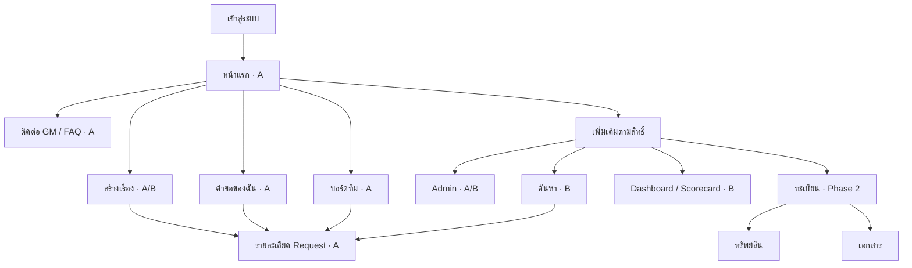
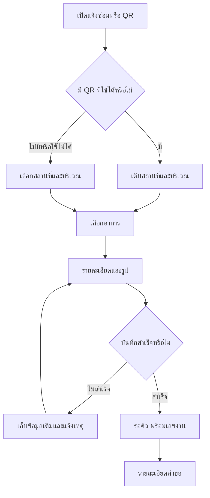
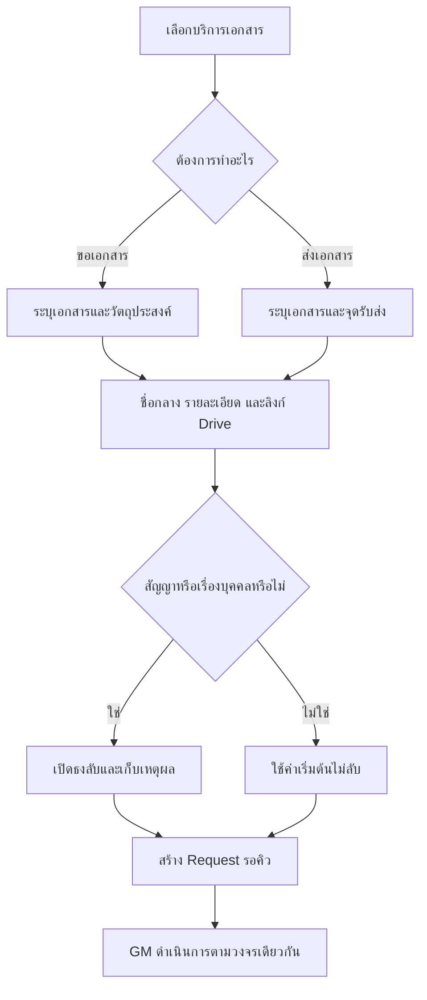
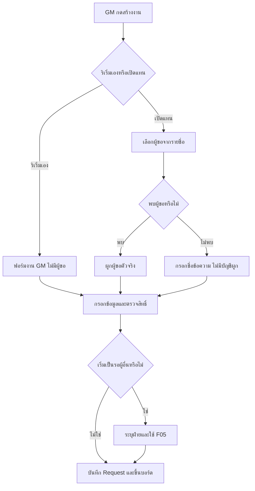
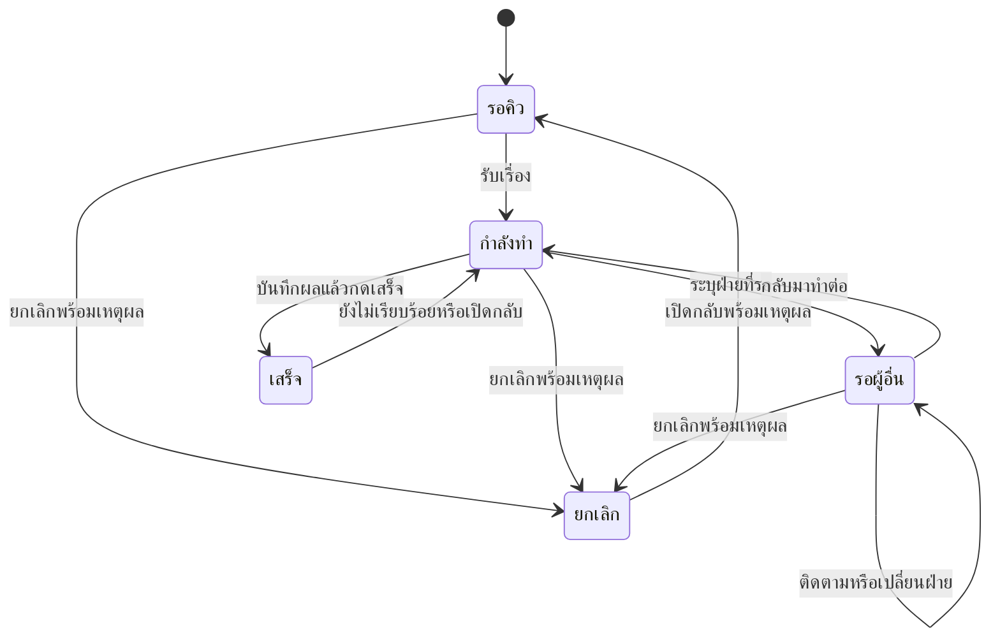
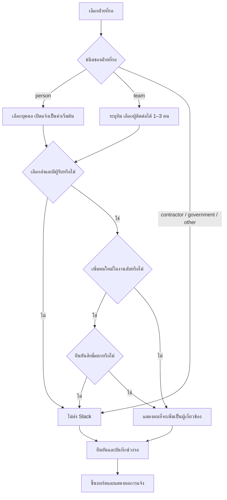
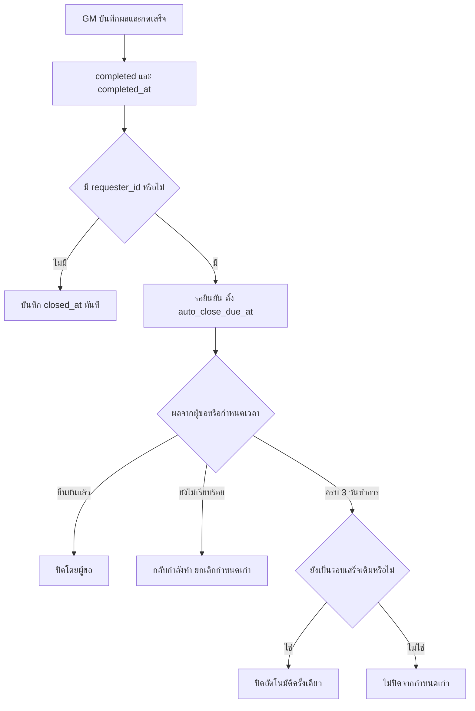

# Part 2 — Information Architecture, Sitemap & User Flows
GM One Stop Service • 3 October 2026 • Asia/Bangkok

ฐานข้อกำหนด: Part 1 PRD ประกอบกับ Part 1 — Changelog ฉบับยืนยัน C1–C11 ของผู้ใช้ ซึ่งมีลำดับเหนือ PRD และ Changelog ที่ผู้ช่วยเขียนก่อนหน้านี้ ใช้ชื่อ key จาก C1–C11 ทุกแห่ง ด่าน A ต้องเปิดใช้ได้โดยไม่รอด่าน B

เอกสารนี้กำหนดโครงข้อมูลที่ผู้ใช้มองเห็น เมนู เส้นทางหน้า และจุดตัดสินใจในการใช้งาน ไม่ลงรายละเอียดเลย์เอาต์ใน Part 3 หรือ schema/security rules ใน Part 6

## 0. จุดที่ต้องอ่านให้ตรงกันก่อนใช้ผัง

1. **C8 กับ calendar_ref:** การอ้างปฏิทินที่แก้ทับได้อย่างเดียวจะทำให้งานเก่าเปลี่ยนตามค่าปัจจุบัน จึงตีความ calendar_ref ว่าอ้างค่าปฏิทินที่คัดลอกและคงที่สำหรับเกณฑ์ของงานนั้น ไม่เพิ่มระบบ version ของ policy/calendar วิธีเก็บกำหนดใน Part 6
2. **C4 กับ Viewer:** ใช้ C4 ล่าสุดเป็นหลัก — role viewer อย่างเดียวให้สิทธิ์บอร์ดสรุปและ Dashboard; การอยู่ใน related_person_ids ให้สิทธิ์อ่านรายละเอียด/คอมเมนต์เฉพาะงานที่ถูกเพิ่ม โดยไม่ให้สิทธิ์เปลี่ยนสถานะ งานลับต้องมีการยืนยันเพิ่มบุคคลแยกตาม C3 ด้วย ดังนั้นการเป็น Viewer ไม่ใช่สิทธิ์เปิดงานลับทุกงาน และไม่ใช้ข้อห้ามแบบตายตัวจาก Changelog เก่ามาขัดกับการให้สิทธิ์รายบุคคลที่ยืนยันแล้ว
3. **C11 กับ full-text:** ขอบเขตผลิตภัณฑ์คงเป็นค้นเลขงานและ summary_title จาก request_summaries ในด่าน B ส่วนถ้อยคำทางเทคนิคให้ระบุ edition ใน Part 6 เพราะเอกสาร Firebase ปัจจุบันมี text search สำหรับ Enterprise edition โดยไม่เพิ่ม full-text เข้าขอบเขต Phase 1

อ้างอิงข้อเทคนิคข้อ 3: [Firebase — Use text search, Edition requirements](https://firebase.google.com/docs/firestore/enterprise/text-search)

## 1. Information architecture: จัดตามสิ่งที่ผู้ใช้ต้องทำ

| กลุ่มข้อมูล | หน้าที่ | ขอบเขต |
|---|---|---|
| หน้าแรกและติดต่อ GM | เริ่มเรื่อง เห็นทีมกำลังทำอะไร และรู้ว่าจะติดต่อใคร | A; ค้นหา/ประกาศเพิ่ม B |
| Request | งานหนึ่งรายการตลอดวงจร เปิดเรื่อง รับเรื่อง รอ เสร็จ ปิด เปิดกลับ | A และใช้ต่อทุก Phase |
| คำขอของฉัน | ดูงานที่ฉันเป็นผู้ขอ และงานที่ฉันถูกเพิ่มเป็นผู้เกี่ยวข้อง | A |
| บอร์ดทีม | เห็นคิวและความคืบหน้า; GM จัดคิวและเปลี่ยนสถานะ | A |
| Dashboard / Scorecard | ภาระงาน SLA คอขวด และส่งออกรายสัปดาห์ | B |
| Admin | ข้อมูลอ้างอิง คนและ role ปฏิทิน เนื้อหา QR และค่าธุรกิจ | แยก A/B ชัดเจน |
| ทะเบียน | ทรัพย์สินและเอกสารที่เชื่อมกับ Request | Phase 2 |

**งานเดียว หน้ารายละเอียดเดียว:** งานจากพนักงาน งาน GM ริเริ่ม และงานเปิดแทนใช้หน้ารายละเอียด Request เดียวกัน เมนูและปุ่มเปลี่ยนตาม origin, type, source, ความสัมพันธ์กับงาน และ role ไม่สร้างหน้าระบบ BOI/Damage/จัดซื้อแยกใน Phase 1

**สรุปกับรายละเอียด:** request_summaries เป็นข้อมูลสรุปที่พนักงานผู้ยืนยันบัญชีบริษัทอ่านได้; requests เป็นรายละเอียดที่จำกัดสิทธิ์ ทั้งสองอ้างอิงงานเดียวกัน ไม่ถูกนับเป็นสอง Request คำว่า “สาธารณะ” ใน C11 หมายถึงภายในบริษัทที่เข้าสู่ระบบแล้ว

### 1.1 ค่าที่กำหนดพฤติกรรมของงาน

| กรณี | type | origin | requester_id | เมื่อ GM กดเสร็จ |
|---|---|---|---|---|
| พนักงานแจ้งซ่อมเอง | maintenance | requester | ผู้ขอตัวจริง | รอยืนยัน 3 วันทำการ |
| GM เปิดแจ้งซ่อมแทนพนักงานที่เลือกได้ | maintenance | gm_on_behalf | พนักงานที่เลือก | รอยืนยันจากพนักงานคนนั้น |
| GM เปิดแจ้งซ่อมแทนโดยมีเพียงชื่อข้อความ | maintenance | gm_on_behalf | ไม่มี | completed + closed_at ทันที |
| GM เริ่มงานเอง ทั้งภายในล้วนและข้ามทีม | gm_task | gm_initiated | ไม่มี | completed + closed_at ทันที |
| พนักงานขอ/ส่งเอกสารใน B | document_request / document_intake | requester | ผู้ขอตัวจริง | รอยืนยัน 3 วันทำการ |
| GM เปิดเรื่องเอกสารแทนใน B | document_request / document_intake | gm_on_behalf | พนักงานที่เลือก หรือไม่มีกรณีชื่อข้อความ | พิจารณาจากการมี requester_id |
| งานภายในจาก Trello ใน milestone ท้าย | gm_task | gm_initiated | ไม่มี | อ่านสถานะจากต้นทาง; ไม่มีปุ่มเปลี่ยนสถานะบนเว็บ |

ทุกกรณีเก็บ created_by_id ตามผู้สร้างที่ตรวจสอบได้ โดยข้อมูลผู้สร้างจาก Trello จัดการ mapping ใน Part 6 ไม่เดาว่าเป็นผู้ที่เปิดหน้าเว็บขณะ sync

source = web สำหรับงานสร้างในเว็บ; source = trello สำหรับงานนำเข้า ชื่อผู้ขอแบบข้อความไม่ใช่บัญชีผู้ใช้ ไม่ให้สิทธิ์หรือส่งแจ้งเตือนด้วยการเดาตัวตนจากชื่อ

### 1.2 คำศัพท์และ key ที่ใช้ร่วมกัน

- type: maintenance, gm_task, document_request, document_intake
- origin: requester, gm_on_behalf, gm_initiated
- role: requester, gm_staff, gm_admin, viewer
- status: queued, in_progress, waiting, completed, cancelled
- ชื่อสถานะ: รอคิว / กำลังทำ / รอผู้อื่น / เสร็จ / ยกเลิก
- category: หนึ่งใน 7 หมวด GM เดิม ใช้จัดกลุ่มงาน ไม่ใช้แทน type
- related_person_ids: สิทธิ์รายละเอียดรายบุคคล; team_labels: ป้ายเพื่อรายงาน/filter เท่านั้น
- waiting_on.kind: person, team, contractor, government, other; ใช้ person_id, team_label, name ตามชนิด
- ทุกงานมี summary_title; งานลับใช้ is_confidential และ sensitivity_reason
- งานเสร็จ/ปิดใช้ completed_at, auto_close_due_at, closed_at; ไม่มีสถานะที่หกชื่อ “ปิดแล้ว”
- งานปัจจุบันของ GM ใช้ focus_request_id, presence_status, presence_updated_at
- การเตือนซ้ำเก็บ reminded_at ใน history
- SLA ใช้ sla_snapshot และ key ภายในตาม C8; เป้าวางแผนใหม่ใช้ planned_due_at

## 2. Navigation สำหรับมือถือและ desktop

| ผู้ใช้ | มือถือ | Desktop |
|---|---|---|
| Requester | หน้าแรก / คำขอของฉัน / บอร์ดทีม / ติดต่อ GM; ปุ่มแจ้งซ่อมเด่นในหน้าแรก | เมนูหลักชุดเดียวกัน พื้นที่รายการกว้างขึ้น |
| GM Staff | เมนูพนักงาน พร้อม “สร้างงาน GM/เปิดแทน” และ action ในบอร์ด/รายละเอียด; Dashboard เพิ่มใน B | Sidebar หน้าแรก / บอร์ดทีม / คำขอของฉัน / ติดต่อ GM พร้อมปุ่มสร้างงาน; Dashboard เพิ่มใน B |
| GM Admin | เหมือน GM Staff และเข้า Admin ผ่านเมนูเพิ่มเติม | เหมือน GM Staff และมี Admin ใน sidebar |
| Viewer | หน้าแรก / คำขอของฉันสำหรับงานที่ตนมีความสัมพันธ์ / บอร์ดสรุป / ติดต่อ GM; Dashboard เพิ่มใน B | เมนูอ่านภาพรวม พร้อม Dashboard ใน B; รายละเอียดขึ้นกับสิทธิ์รายงานตาม C4 |

role viewer ไม่ได้สิทธิ์สร้างหรือจัดคิวด้วย role นี้ แต่ถ้าเป็น requester_id จากการเปิดแทน ก็ใช้สิทธิ์ผู้ขอของงานนั้นเพื่ออ่านและยืนยันได้ หากเป็น related_person_ids ได้สิทธิ์อ่าน/คอมเมนต์เท่านั้น

**คำขอของฉันเป็นหน้าเดียว มีสองแท็บ:**
- “ที่ฉันขอ”: requester_id ตรงกับผู้ใช้ รวมงานที่ GM เปิดแทนด้วยบัญชีพนักงาน
- “เกี่ยวข้องกับฉัน”: มีชื่อใน related_person_ids รวม gm_task และงานลับที่ได้รับสิทธิ์อย่างถูกต้อง
- GM มีตัวกรอง “ที่ฉันสร้าง” เพิ่มได้ในหน้าเดียว เพื่อหางาน origin = gm_initiated / gm_on_behalf ของตน

ไม่รวมสองแท็บแล้วนับเป็นสองงาน หากคนเดียวเป็นทั้งผู้ขอและผู้เกี่ยวข้อง งานเดียวปรากฏได้ในแต่ละแท็บตามบริบท แต่ตัวเลขรวมใช้ Request ไม่ซ้ำ

**หน้าแรกใน A:** ปุ่มแจ้งซ่อม/คำขอของฉัน/ถามทีม GM, กลุ่มงานปัจจุบันของ GM 3 คน, บอร์ดย่อสด และทางสร้างงานสำหรับ GM แสดงเฉพาะบริการที่เปิดใช้แล้ว ปุ่มขอ/ส่งเอกสาร ช่องค้นหา และประกาศปรากฏเมื่อเปิด B

**ติดต่อ GM ใน A:** แสดงหน้าที่ของ Napat / Gorawit / Sirirat, ช่องทางติดต่อที่ตั้งไว้, FAQ และลิงก์บริการเดิม เช่น expense tracking เมื่อมี URL จริง “ถามทีม GM” เปิดหน้านี้ ไม่เพิ่มแชตบอตหรือส่งข้อความแทนผู้ใช้โดยอัตโนมัติ

ข้อแลกเปลี่ยน: ใช้ชื่อเมนูร่วมกันทั้งสองอุปกรณ์ ลดภาระการเรียนรู้ ขณะที่ GM ได้ปุ่มงานและพื้นที่บอร์ดเพิ่มตาม role

## 3. Sitemap

ผังนี้แสดงความสัมพันธ์ของพื้นที่หลัก ตาราง route ถัดไปเป็นรายละเอียดเส้นทางที่ใช้สร้างจริง “เพิ่มเติมตามสิทธิ์” เป็นกลุ่มเมนู ไม่จำเป็นต้องสร้างเป็นหน้าข้อมูลอีกหน้า

### 3.1 Routes ของด่าน A

พารามิเตอร์ใน URL เป็นบริบทสำหรับเปิดหน้า ไม่ใช่สิทธิ์ในการทำรายการ ระบบตรวจ role และสิทธิ์คำขอทุกครั้ง

| Route | หน้า/หน้าที่ | ผู้ใช้ | Story |
|---|---|---|---|
| /login | เข้าสู่ระบบและกลับไปยังลิงก์เดิมภายในแอป | ทุกคนก่อนเข้าระบบ | US-01 |
| / | หน้าแรก ปุ่มลัด งานปัจจุบัน บอร์ดย่อ | ผู้ใช้บริษัทที่เข้าได้ | US-02, US-21 |
| /q/:qr_id | รับ QR และส่งต่อฟอร์มที่เติมสถานที่/บริเวณ | ผู้แจ้งซ่อม | US-03 |
| /requests/new?type=maintenance&origin=requester | แจ้งซ่อม 4 ขั้น | ผู้ใช้ที่มีสิทธิ์เปิดเรื่อง | US-03 |
| /requests/new?type=gm_task&origin=gm_initiated | ฟอร์ม GM สร้างงานหนึ่งหน้า | GM Staff/Admin | US-19 |
| /requests/new?type=maintenance&origin=gm_on_behalf | ฟอร์มเดิมพร้อมเลือกผู้ขอ/ชื่อข้อความ | GM Staff/Admin | US-20 |
| /my-requests | ที่ฉันขอ / เกี่ยวข้องกับฉัน; GM กรองที่ฉันสร้างได้ | ผู้ใช้ที่มีงานในความสัมพันธ์นั้น | US-05 |
| /requests/:request_id | สรุปหรือรายละเอียดตามสิทธิ์; action ตามบทบาท | ตรวจสิทธิ์รายงาน | US-05–09, US-19–21 |
| /board | บอร์ดสรุป; GM จัดคิวและดูงานที่ตนมีสิทธิ์ | ทุก role; สิทธิ์แก้เฉพาะ GM | US-10 |
| /team | หน้าที่ทีม ช่องทางติดต่อ FAQ | ทุก role | US-02 |

**Admin ใน A**

| Route | หน้าที่ |
|---|---|
| /admin/locations | สถานที่และบริเวณย่อย การเปิด/ปิดใช้งาน |
| /admin/qr | เลือกสถานที่/บริเวณและสร้าง QR ที่ผูกกับบริเวณนั้น |
| /admin/users | รายชื่อพนักงาน role และสถานะการจับคู่ Slack; วิธีนำเข้าตัดสินใน Part 6 |
| /admin/calendars | ปฏิทินบริษัท จันทร์–ศุกร์ และวันหยุด |
| /admin/content | แก้เนื้อหาติดต่อทีม GM / FAQ |

ทุกเส้นทาง Admin ใช้ gm_admin เท่านั้น; หน้า Admin ไม่มีระบบจัดการสมาชิกทีมทั้งบริษัท

### 3.2 ส่วนที่เพิ่มในด่าน B

| Route/พื้นที่ | สิ่งที่เพิ่ม | Story |
|---|---|---|
| /requests/new?type=document_request&origin=requester | ขอเอกสาร; GM เลือก origin = gm_on_behalf ได้ | US-04, US-20 |
| /requests/new?type=document_intake&origin=requester | ส่งเอกสาร; GM เลือก origin = gm_on_behalf ได้ | US-04, US-20 |
| /search?q=... | ค้นเลขงานและ summary_title จาก request_summaries | US-02 |
| /dashboard | Dashboard เต็มและ Scorecard; filter และ CSV ในหน้านี้ | US-11, US-12 |
| /admin/sla | ตั้งสองแม่แบบ SLA เริ่มต้น | US-13 |
| /admin/calendars | เพิ่มปฏิทินรายสถานที่ในหน้าเดิม | US-13 |
| /admin/content | เพิ่มการจัดการประกาศ | US-02 |
| / และ /requests/:request_id | เพิ่มข้อมูล SLA เมื่อมีเกณฑ์ ใช้หน้าเดิม | US-06, US-13 |
| Slack และเมนูบัญชี | actions/digest; ตัวเลือกติดตั้ง PWA เมื่อรองรับ | US-14, US-16 |

Announcement เป็นเนื้อหาบนหน้าแรก ไม่ต้องมีระบบข่าวหลายหน้า; Scorecard เป็นส่วนใน Dashboard ไม่สร้าง Dashboard ซ้ำอีกชุด

### 3.3 Milestone ท้ายและ Phase 2

| ช่วง | Route/พื้นที่ | กติกา |
|---|---|---|
| Trello | /admin/trello | ตั้ง mapping; GM/Admin เห็นสถานะและรายการรอตรวจตามสิทธิ์ |
| Trello | /board และ /requests/:request_id เดิม | ป้าย “จาก Trello” และเปิดต้นทาง ไม่มีการแก้สถานะบนเว็บ |
| Phase 2 | /assets, /assets/:asset_id | ทะเบียนทรัพย์สิน ผู้ถือครอง สถานที่ และประวัติซ่อมที่เชื่อม Request |
| Phase 2 | /documents, /documents/:document_id | ทะเบียนเอกสาร ค้นหา ขอเอกสาร ต่ออายุ/สัญญา ตามสิทธิ์ |

ไม่แสดงปุ่มที่ใช้งานไม่ได้ของ B/Trello/Phase 2 ใน Pilot หากเปิด deep link ไปส่วนที่ยังไม่เปิดใช้ ให้บอกว่า “บริการนี้ยังไม่เปิดใช้งาน” และมีทางกลับหน้าแรก/ติดต่อ GM โดยไม่ต้องสร้างข้อมูลจำลองให้ดูเหมือนเปิดใช้แล้ว

## 4. เส้นทางเข้าร่วมกันและขอบเขตสิทธิ์

| จุดเข้า | พฤติกรรม |
|---|---|
| เปิดเว็บโดยตรง | ตรวจบัญชีแล้วไปหน้าแรก |
| QR | หากต้อง login ให้จำบริบท QR แล้วกลับมาฟอร์มเดิม |
| Slack DM | login หากจำเป็น จากนั้นตรวจสิทธิ์ล่าสุดของ Request ก่อนแสดงรายละเอียด |
| ลิงก์งานทั่วไปบนบอร์ด | มีสิทธิ์รายละเอียด → เปิดเต็ม; มีเพียงสิทธิ์สรุป → แสดงเฉพาะสรุปใน route เดิม |
| ลิงก์งานลับที่ไม่มีสิทธิ์ | แสดงข้อความกลาง “ไม่พบงานหรือคุณไม่มีสิทธิ์เปิดรายการนี้” โดยไม่เผยชื่อ/บุคคล/รูป |
| บัญชีอยู่นอก @tdfb.co หรือปิดใช้งาน | ไม่ให้เข้าข้อมูลบริษัทและให้เปลี่ยนบัญชี |

การเปิด route เดียวไม่ได้หมายถึงส่ง requests ทั้ง document ให้ทุกคน สำหรับผู้มีสิทธิ์สรุป หน้าอ่านเพียงข้อมูลที่เปิดเผยได้ ไม่มี timeline/คอมเมนต์/รูป/ไฟล์แอบโหลดไว้

**บอร์ดทั่วไป:** งานลับไม่ขึ้นเป็นรายการ เห็นเพียง “งานภายใน X รายการ” เป็นจำนวนรวม ผู้ขอหรือผู้เกี่ยวข้องเข้าถึงงานลับที่ได้รับสิทธิ์จากคำขอของฉันหรือ direct link ส่วน GM มีมุมมองจัดการที่เข้าถึงงานลับตามสิทธิ์ของตน

**หน้าแรกของทีม:** ถ้างานปัจจุบันเป็นงานลับและผู้ดูไม่มีสิทธิ์ แสดงเพียง “งานภายใน” โดยไม่ส่งชื่อหรือ focus_request_id ของงานลับให้ผู้ดูที่ไม่มีสิทธิ์ ข้อมูลภายใน profile กับสิ่งที่แสดงต่อผู้ชมต้องบังคับสิทธิ์ให้สอดคล้องกันใน Part 6

## 5. F01 — แจ้งซ่อมและ QR
ด่าน A • US-03 • P1 / KR2.2

- 4 ขั้นของฟอร์ม: สถานที่ → บริเวณ → อาการ → รายละเอียด/รูป; QR เติมสองขั้นแรกให้ ผู้ใช้ตรวจหรือเปลี่ยนได้
- ทุกหน้าฟอร์มแสดงสถานที่/บริเวณที่กำลังแจ้ง เพื่อให้เห็นเมื่อ QR ชี้ผิดจุด
- ถ้า QR ถูกปิดหรือบริเวณถูกยกเลิก ไม่เติมค่าที่ใช้ไม่ได้ ให้เลือกใหม่พร้อมข้อความสั้น
- ถ้าสถานที่ยังไม่มีบริเวณให้เลือก อนุญาต “ไม่ระบุบริเวณ” และให้บอกจุดเกิดปัญหาในรายละเอียด โดยไม่สร้างบริเวณใหม่เอง เป็น fallback เพื่อไม่ให้พื้นที่ที่ยังตั้งค่าไม่ครบขวางการแจ้ง
- รูปเป็นตัวเลือกตาม PRD; อาการ “อื่นๆ” ต้องมีคำอธิบายพอให้รับเรื่องได้
- ก่อนบันทึกใช้ summary_title ที่เปิดเผยได้ และตั้งธงลับตาม C6 หากเข้าเงื่อนไข
- ผลบันทึก: type = maintenance, origin = requester, requester_id = ผู้ขอจริง, created_by_id = ผู้กดสร้าง, source = web, status = queued
- กดส่งซ้ำ/ลองใหม่หลังเครือข่ายขาดไม่สร้างงานซ้ำ และไม่ล้างข้อมูลที่ยังไม่ยืนยันบันทึก
- Slack ทางเดียวแจ้งผู้รับผิดชอบที่ตั้งไว้ การส่งแจ้งล้มเหลวไม่ยกเลิก Request ที่บันทึกแล้ว

## 6. F02 — ขอเอกสาร / ส่งเอกสารอย่างง่าย
ด่าน B • US-04 • P1 / KR2.2

- “ขอเอกสาร” ใช้ type = document_request; “ส่งเอกสาร” ใช้ type = document_intake
- ภ.พ.20/หนังสือรับรองบริษัททั่วไปไม่ลับโดยค่าเริ่มต้น แต่ summary_title ต้องไม่ใส่เลขเอกสารหรือข้อมูลส่วนบุคคล
- เอกสารจริงเก็บใน Google Drive เว็บเก็บข้อมูลประกอบและลิงก์ตามสิทธิ์ของ Drive
- origin = requester หรือ gm_on_behalf ตามผู้เริ่มฟอร์ม ใช้กติกาเลือกผู้ขอใน F03
- เมื่อบันทึกไม่สำเร็จคงฟอร์มเดิม ให้แก้ช่องที่ผิดหรือลองใหม่ในหน้าเดิม
- การส่งเรื่อง/GM กดเสร็จไม่ใช่หลักฐานว่าลงทะเบียนในทะเบียนเอกสารแล้ว สาม tile ที่ยังไม่เชื่อมใน Scorecard คงสถานะเดิมจน Phase 2

## 7. F03 — GM ริเริ่มเอง / GM เปิดแทนผู้ขอ
ด่าน A • US-19 / US-20 • P1 / P3 / KR2.2

**GM ริเริ่มเอง:** ฟอร์มหนึ่งหน้า มี summary_title, category จาก 7 หมวดเดิม, สถานที่ไม่บังคับ, ผู้รับผิดชอบ, related_person_ids, team_labels, สถานะเริ่มต้น และธงลับ ใช้ type = gm_task, origin = gm_initiated และไม่มี requester_id เป้าการทำรายการภายใน 1 นาที

งาน BOI, Damage, เพจปลอม และจัดซื้อใช้ฟอร์มเดียวกัน การเลือก “รอผู้อื่น” เปิดส่วนรอในฟอร์มนี้ ไม่ส่งไปสร้างคำขออีกชุด สำหรับการสร้างครั้งแรก บันทึกงาน ช่วงรอ และสิทธิ์ที่ยืนยันเป็นผลเดียวกัน แล้วจึงแจ้ง Slack

**GM เปิดแทน:** ใช้ฟอร์มประเภทบริการเดิม และแสดงผู้ขอไว้ด้านบน การเลือกผู้ขอไม่เพิ่มขั้นของ wizard พนักงาน ใช้ origin = gm_on_behalf และ created_by_id เป็น GM

| ผู้ขอที่เลือก | สิ่งที่แสดงก่อนบันทึก | ผล |
|---|---|---|
| บัญชีพนักงาน | ชื่อผู้ขอตัวจริง และชื่อ GM ผู้ช่วยเปิด | ผู้ขอเห็นในคำขอของฉัน ได้แจ้งสถานะ และยืนยันหลังเสร็จได้ |
| ชื่อข้อความ | “ผู้ขอรายนี้ยังไม่มีบัญชีในรายการ งานจะปิดเมื่อ GM กดเสร็จ” | ไม่มี requester_id; ไม่ส่งแจ้งหรือให้สิทธิ์ด้วยการเดาชื่อ; GM ปิดได้ทันที |

ชื่อผู้ขอแบบข้อความอยู่ในรายละเอียดจำกัดสิทธิ์ ไม่ใส่ใน summary_title บนบอร์ด สำหรับ metric self-service งาน gm_on_behalf ทั้งสองแบบอยู่ในฐาน แต่ไม่ใช่ตัวตั้ง ส่วน gm_initiated ที่ไม่มีผู้ขออยู่นอกฐานนี้

## 8. F04 — วงจรสถานะที่ GM ใช้ร่วมกัน
ด่าน A • US-06 / US-07 / US-09 / US-10 • P1 / P2 / P3

ผังแสดงทางหลักและทางเปิดกลับ มี 5 สถานะเท่านั้น การยืนยันและ closed_at อธิบายใน F06

เส้นในผังเป็นเส้นทางหลัก ไม่ใช่การจำกัดว่าห้ามย้อนสถานะอื่นที่ PRD อนุญาต ทุกการเปลี่ยนต้องตรวจ source/สิทธิ์ ข้อมูลจำเป็น และ history เช่นเดียวกัน กรณี GM สร้างงานเริ่มต้นเป็น in_progress หรือ waiting ให้เริ่มที่สถานะนั้นตาม F03 โดยมีประวัติการสร้างครบ

| Action ของ GM | การทำงานใน A | สิ่งที่เพิ่มใน B |
|---|---|---|
| รับเรื่อง/มอบหมาย | เปลี่ยนสถานะหรือผู้รับผิดชอบ มี history และแจ้งผู้ขอ | ใช้ action จาก Slack ได้ตามสิทธิ์ |
| ประสานช่างแล้ว | บันทึกเหตุการณ์ ผู้ทำ เวลา และข้อมูลการประสานใน history | ใช้ประเมิน SLA milestone_type = coordinate เมื่อมี sla_snapshot |
| รอผู้อื่น | เปิดส่วน waiting_on/ผู้ติดต่อ/การแจ้งตาม F05 | SLA ของ GM พักระหว่างรอ |
| ติดตามแล้ว | บันทึกความคืบหน้าและเริ่มนับ stale ใหม่ | ใช้กติกาเวลาเดียวกันกับรายงาน/digest |
| เสร็จ | บันทึกผล ใช้ F06 | ประเมิน resolve เมื่อเกณฑ์เป็นการทำเสร็จ |
| ยกเลิก/เปิดกลับ | ต้องมีเหตุผล ประวัติเดิมยังอยู่ | ผลที่เคยเกิดกับ SLA ไม่ถูกล้าง |

ด่าน A มีปุ่ม “ประสานช่างแล้ว” ตั้งแต่ Pilot โดยยังไม่มีค่าผ่าน/ไม่ผ่าน SLA หรือ countdown ของ SLA จึงไม่ต้องรอด่าน B

**บอร์ด:** filter คน/ประเภท/สถานที่อยู่ A; มุมมองตามคน/สถานที่ใช้ข้อมูลชุดเดิมตาม US-10 การลากและปุ่มเปลี่ยนสถานะเรียก flow เดียวกัน หากปลายทางต้องมีข้อมูลให้เปิดแบบสั้นและยังไม่บันทึกจนข้อมูลครบ

**source = trello:** แสดง read-only และปุ่มเปิด Trello ไม่มี action เปลี่ยนสถานะบนเว็บหรือ Slack ของเว็บ

## 9. F05 — รอผู้อื่น ให้สิทธิ์ และแจ้งฝ่ายที่รอ
ด่าน A • C3 / C4 / US-07 • P2 / P3

### 9.1 สิ่งที่เลือกและสิ่งที่ระบบทำ

| waiting_on.kind | ข้อมูลของฝ่ายที่รอ | การแจ้ง |
|---|---|---|
| person | person_id ของพนักงานที่เลือก | เปิดส่ง Slack DM เป็นค่าเริ่มต้น GM ปิดได้ก่อนยืนยัน |
| team | team_label | ผู้ติดต่อไม่บังคับ หากต้องการแจ้งเลือก 1–3 คน ไม่มีรายชื่อก็ยังบันทึกรอทีมได้ |
| contractor | name | ไม่ส่งแจ้ง |
| government | name | ไม่ส่งแจ้ง |
| other | name | ไม่ส่งแจ้ง |

ส่วนผู้ติดต่อของ team เป็นการเลือกคนในคำขอนั้น ไม่ใช่การกำหนดสมาชิกทีมทั้งบริษัท กรณีไม่มีรายชื่อผู้ติดต่อกลางยังทำ flow นี้ได้จาก people picker

รายชื่อผู้รับแจ้งของช่วงรอเป็นคนที่ GM เลือกสำหรับช่วงนั้น ไม่ใช่ทุกคนใน related_person_ids ผู้เกี่ยวข้องที่เพิ่มไว้เพื่ออ่านงานจึงไม่ถูกส่งเตือนทุกครั้ง รูปแบบเก็บผู้ติดต่อและผู้รับของแต่ละเหตุการณ์กำหนดใน Part 6 โดยไม่เปลี่ยนชื่อ key ที่ C1–C11 ยืนยันแล้ว

### 9.2 หน้าก่อนยืนยัน

GM เห็นสามส่วนพร้อมกัน:
1. กำลังรอใคร และกำลังเริ่มช่วงรอใหม่หรือเปลี่ยนจากฝ่ายเดิม
2. จะส่งถึงใคร พร้อมตัวเลือกปิดการแจ้ง
3. ผู้รับคนใดจะถูกเพิ่มใน related_person_ids เพื่ออ่านรายละเอียดและคอมเมนต์

งานทั่วไป: เพิ่มผู้รับที่แจ้งเป็น related person อัตโนมัติเมื่อ GM ยืนยัน โดยแสดงรายชื่อก่อนยืนยันแล้ว

งานลับ: หากมีคนใหม่ต้องแยกการยืนยัน “ให้บุคคลเหล่านี้อ่านรายละเอียดงานลับ” ออกจากการยืนยันสถานะ หากไม่ยืนยันการให้สิทธิ์ ให้ปิดการแจ้งคนที่ยังไม่มีสิทธิ์ก่อนบันทึก งานยังเปลี่ยนเป็นรอผู้อื่นได้ ข้อความ Slack ของงานลับใช้ข้อความกลางและลิงก์ ไม่มีรายละเอียดหรือ summary_title ของงานลับ

related_person_ids ให้สิทธิ์อ่าน/คอมเมนต์ ไม่ให้สิทธิ์เปลี่ยนสถานะหรือยืนยันแทน requester_id ข้อกำหนดนี้ใช้เหมือนกันกับผู้ที่มี role viewer ซึ่งได้รับสิทธิ์เฉพาะงานอย่างชัดเจน

### 9.3 ผลหลังยืนยันและความผิดพลาด

- บันทึก status = waiting, waiting_on, waiting_since, history และผู้เกี่ยวข้องที่ยืนยัน แล้วจึงส่ง Slack
- ถ้าเป็นการเปลี่ยนฝ่าย A → B ให้จบช่วงของ A และเปิดช่วงของ B ไม่รีเซ็ตประวัติรอเก่า
- ส่งสำเร็จแสดงผลให้ GM; ส่งไม่สำเร็จแสดงเหตุ เช่น จับคู่ Slack ไม่ได้/ส่งไม่สำเร็จ โดยไม่ย้อนสถานะงาน
- retry ต้องตรวจคนรับ สิทธิ์ และฝ่ายที่กำลังรอปัจจุบันอีกครั้ง ไม่ส่งเหตุการณ์เก่าให้คนที่ถูกเอาออกหรือฝ่ายที่ไม่ได้รอแล้ว
- การส่งจากเหตุการณ์เดิมซ้ำไม่สร้าง DM ซ้ำ ไม่มีการส่งออกไปผู้รับเหมา/หน่วยงานรัฐ/other

### 9.4 “ติดตามแล้ว” และเตือนซ้ำ

| ทางเลือก | ผลกับงาน | ผลกับ Slack |
|---|---|---|
| ติดตามแล้ว | history และ last_updated_at เปลี่ยน; waiting_since และเวลารอสะสมคงความหมายเดิม | ไม่ส่ง |
| ติดตามแล้ว + ส่งเตือนอีกครั้ง | ผลเหมือนข้างต้น พร้อมบันทึก reminded_at ใน history | ส่งให้ person/team ที่มีผู้ติดต่อและยังมีสิทธิ์ |
| ใช้โควตาเตือนซ้ำของวันทำการนั้นแล้ว | ยังบันทึกติดตามแล้วได้ | ไม่ส่งรอบใหม่ และแสดงว่าเตือนแล้ววันนี้ |

โควตา 1 ครั้งต่อวันทำการเป็น **ต่องานรวมผู้รับชุดนั้น** ไม่ใช่คนละโควตาต่อผู้รับ การลองส่งเหตุการณ์เดิมหลังล้มเหลวเป็น retry ไม่ใช่การเตือนใหม่อีกครั้ง

เพื่อให้ flow ใช้งานแน่นอนใน Part 2: การเตือนซ้ำใช้งานในวันเปิดทำการตามปฏิทินที่งานใช้ ส่วนวันปิดทำการยังบันทึก “ติดตามแล้ว” ได้แต่รอวันทำการถัดไปจึงส่งเตือนซ้ำ การแจ้งครั้งแรกเมื่อยืนยันเข้า waiting เป็นคนละเหตุการณ์กับโควตาเตือนซ้ำนี้ วิธีควบคุมพร้อมกันและการ retry กำหนดใน Part 6

## 10. F06 — GM กดเสร็จ ผู้ขอยืนยัน และปิดอัตโนมัติ
ด่าน A • C2 / C5 / US-08 / US-09

- การมี requester_id เป็นเกณฑ์มีขั้นยืนยัน ไม่ใช้ว่า “ผู้สร้างเป็น GM หรือไม่” เพื่อแยกงานเปิดแทนบัญชีจริงออกจากงานชื่อข้อความได้ถูกต้อง
- gm_task ไม่มี requester_id จึงปิดทันที กรณี gm_on_behalf ที่มีแต่ชื่อข้อความก็ปิดทันทีเช่นกัน
- auto_close_due_at คำนวณจาก completed_at + 3 วันทำการ: A ใช้ปฏิทินบริษัท; B ใช้ปฏิทินสถานที่ หรือบริษัทถ้าไม่ผูกสถานที่
- แสดงกำหนดยืนยันแก่ผู้ขอและ GM “เสร็จ รอคุณยืนยัน” เป็นป้ายกำกับของ completed ไม่เพิ่มคอลัมน์
- requester_id เท่านั้นที่กดยืนยันหรือแจ้งยังไม่เรียบร้อยในฐานะผู้ขอ related_person_ids แสดงความคิดเห็นได้แต่ไม่มีปุ่มยืนยันแทน
- แจ้งยังไม่เรียบร้อยต้องมีเหตุผล กลับ in_progress และกำหนดปิดรอบเดิมใช้ไม่ได้
- ทุกการปิดตรวจสถานะล่าสุด ถ้าปิดแล้วหรือเปิดกลับแล้ว ต้องไม่สร้างผลปิดซ้ำหรือปิดด้วยกำหนดเก่า
- history แยกการปิดโดยผู้ขอ การปิดโดย GM และการปิดอัตโนมัติ ไม่เรียก auto-close ว่าผู้ขอยืนยันแล้ว
- เมื่อมี closed_at หรือเป็น cancelled ให้ปลด focus_request_id ที่อ้างงานนั้นตาม C7
- กรณี completed ที่ยังรอยืนยันยังไม่มี closed_at จึงไม่ถือว่าปิดแล้วในกติกาปลดหมุด แสดงสถานะจริงกำกับงานปัจจุบันจนกว่าจะเปลี่ยนหมุดหรือปิดงาน

## 11. F07 — งานปัจจุบันและ presence บนหน้าแรก
ด่าน A • C7 / US-21 • P1 / P3

| จุดเริ่ม | การทำรายการ | ผล |
|---|---|---|
| GM เปิดงาน in_progress | แตะ “กำลังทำตอนนี้” | focus_request_id เปลี่ยนเป็นงานนี้แทนหมุดเดิม และหน้าแรกอัปเดตสด |
| ไม่มีงานปัก | เปิดหน้าแรก | ใช้งาน in_progress ที่ last_updated_at ล่าสุดของ GM คนนั้น |
| ไม่มีงานปักหรือ in_progress | เปิดหน้าแรก | แสดง “ยังไม่มีงานที่กำลังทำ” |
| งานที่จะแสดงเป็นงานลับ | ตรวจสิทธิ์ผู้ชม | คนไม่มีสิทธิ์เห็น “งานภายใน”; คนที่มีสิทธิ์เปิดรายละเอียดตามกติกางาน |
| GM เลือกสถานที่/สถานะสั้น | บันทึก presence_status | เก็บ presence_updated_at และแสดงเวลาที่ตั้ง |
| ข้ามวันตาม Asia/Bangkok | reset ตรวจข้อมูลล่าสุด | presence_status กลับ “ไม่ระบุ”; focus_request_id ยังอยู่ |
| งานที่ปักถูกปิดหรือยกเลิก | ตรวจงานล่าสุด | ปลดหมุดและใช้ fallback |

presence_status ใช้ค่าเหล่านี้เท่านั้น: อยู่ WH300 / อยู่ FAC16 / อยู่ FAC17 / อยู่ Office 195 / อยู่ Cafe 222 / ออกนอกสถานที่ / ลา / ไม่ระบุ

- การปัก/เปลี่ยน presence ไม่ใช่ความคืบหน้าของ Request ไม่แก้ last_updated_at เพื่อให้ stale หาย
- หากงานเดียวมี GM ช่วยกัน ทั้งสอง profile ปักงานเดียวกันได้ แต่การนับ Request บนบอร์ด/รายงานไม่เพิ่มเป็นสองงาน
- เมื่อ reset ล่าช้าและ GM เพิ่งตั้ง presence ของวันใหม่ ต้องคงค่าของวันใหม่ไว้ ไม่ล้างเพราะ job ของวันก่อนมาช้า
- ผู้ใช้ไม่จำเป็นต้องตั้ง presence; ค่า “ไม่ระบุ” ไม่ถูกตีความว่าไม่ทำงานหรือไม่อยู่บริษัท
- รูปทีมใช้รูปจริงเมื่อมี ระหว่างเตรียมรูปใช้ชื่อย่อตาม assumption เดิม

ข้อแลกเปลี่ยน: ทีมระบุงานปัจจุบันได้โดยไม่ต้องแก้สถานะงาน และระบบยังมี fallback เมื่อไม่ได้ปัก แต่ presence เป็นข้อมูลที่ผู้ใช้ตั้งเอง ไม่ใช่ตำแหน่งที่ระบบตรวจพบอัตโนมัติ

## 12. Flow และสิทธิ์ของส่วนด่าน B

### 12.1 ค้นหา
เปิดช่องค้นหา → ใส่เลขงานหรือ summary_title → เลือกผลจาก request_summaries → เข้าหน้า /requests/:request_id ซึ่งตรวจสิทธิ์รายละเอียดซ้ำ

- ไม่ค้นคอมเมนต์ รูป ไฟล์ หรือข้อความใน requests ใน Phase 1
- งานลับไม่ปรากฏใน collection สรุปทั่วไป จึงเข้าผ่านคำขอของฉัน/บอร์ด GM ที่มีสิทธิ์หรือ direct link แทน
- ไม่พบผลให้แสดงวิธีค้นเลขงาน/ชื่องานอีกครั้ง ไม่รายงานว่าเป็นปัญหาระบบ
- การ normalize ข้อความ รูปแบบ match และข้อจำกัด query ตัดสินใน Part 6 โดยไม่ขยายเป็น full-text

### 12.2 Dashboard / Scorecard / CSV
ผู้มี role gm_staff / gm_admin / viewer เปิด Dashboard → เลือกช่วงเวลาและ filter → ดูค่าที่คำนวณตามสิทธิ์ → เปิดรายการที่ตนมีสิทธิ์ หรือส่งออก CSV ในขอบเขตเดียวกัน

- Viewer และ Scorecard ใช้ aggregate จาก Cloud Function ตาม C11 ไม่ดาวน์โหลดรายละเอียดมาให้ client รวม
- Viewer ได้ Dashboard ทุก widget ในขอบเขตข้อมูลที่เปิดเผยได้ แม้มีสิทธิ์รายงานบางรายการจาก related_person_ids ก็ไม่ทำให้ได้ Dashboard ลับทั้งทีม
- จำนวนงานภายในที่แสดงแก่พนักงานใน A ใช้จำนวนรวมที่อนุญาตเท่านั้น งานนี้เป็นส่วนของความลับใน A ไม่ต้องรอ Dashboard เต็มของ B
- Scorecard งานซ่อมค้างใช้เกณฑ์ใน PRD เดิม อีกสามตัวคง “ยังไม่เชื่อมข้อมูล” และลิงก์ต้นทางที่ตั้งไว้
- ค่า SLA ที่ยังไม่มีเกณฑ์แสดง “ยังไม่กำหนด SLA”; ไม่มีการแสดงผ่าน/ไม่ผ่าน SLA ในด่าน A
- การแก้ planned_due_at ไม่เขียนทับ original_due_at; หน้ารายละเอียดแสดงว่ามีเป้าวางแผนใหม่พร้อมเหตุผลโดยไม่ล้างเกณฑ์รายงาน

### 12.3 Slack actions / digest
Slack action → ตรวจผู้กดและสถานะล่าสุด → ใช้ validation เดียวกับ action บนเว็บ → บันทึกครั้งเดียว → ข้อมูลหน้าเว็บอัปเดตสด

เมื่อ action ต้องมีข้อมูล เช่น ผลการทำงานหรือเหตุผล ให้เปิดส่วนกรอกที่จำเป็น ไม่ส่งคำสั่งที่ขาดข้อมูล เมื่อเป็น source = trello ให้เปิดต้นทางแทน การตั้งเวลา digest และเนื้อหารายงานทำใน B โดยไม่เป็นเงื่อนไขเปิดใช้ DM ทางเดียวใน A

## 13. Admin และข้อมูลที่ต้องพร้อมตามด่าน

| งาน Admin | Flow ใน A | ส่วนเพิ่ม B |
|---|---|---|
| สถานที่/บริเวณ | เลือกสถานที่ → เพิ่ม/แก้/ปิดบริเวณ → QR อ้างข้อมูลที่ใช้งานได้ | ใช้สถานที่เดิมผูกปฏิทิน |
| QR | เลือกสถานที่/บริเวณ → สร้าง → ทดสอบเปิดฟอร์ม | ใช้เหมือนเดิม |
| ผู้ใช้/role | เตรียมรายชื่อพนักงานและ Slack user ID → แก้ role/สถานะการใช้งานตามสิทธิ์ | ไม่มีระบบสมาชิกทีมเพิ่ม |
| ปฏิทิน | จันทร์–ศุกร์ + วันหยุดบริษัทที่ครอบคลุมปลายปี 2026–ต้นปี 2027 | เพิ่มรายสถานที่และค่า SLA ตาม C8 |
| เนื้อหา | แก้ติดต่อ GM/FAQ | เพิ่มประกาศ |
| SLA | ยังไม่มีหน้าตั้ง SLA ใน Pilot | ตั้งสองแม่แบบ และเก็บ sla_snapshot เมื่อเริ่มเกณฑ์ |
| Trello | ไม่มี dependency | ทำเมื่อถึง milestone ท้าย ไม่เป็น gate |

แหล่งรายชื่อ Google Workspace Directory หรือไฟล์นำเข้าเป็นการตัดสินใจของ Part 6 หน้า people picker ใน flow ใช้รูปแบบเดียวกันไม่ว่าที่มาของรายชื่อเป็นแบบใด ผู้ติดต่อหลักของทีมเป็นข้อมูลเสริม ไม่ต้องมีจึงจะเปิด Pilot ได้

**งานที่ต้องมีใน A แม้ยังไม่มี SLA:** pure functions คำนวณเวลาร่วม, ปฏิทินบริษัท, stale, auto-close, presence reset, การบันทึกประสานช่าง, สิทธิ์และจำนวนงานลับ, Slack DM ทางเดียว และการแจ้งสถานะการส่ง

## 14. จุดร่วมของ empty / loading / error / การกลับเข้าหน้าเดิม

รายละเอียดภาพและ microcopy เต็มอยู่ Part 3 แต่เส้นทางต้องรองรับกรณีเหล่านี้ตั้งแต่ IA:

| สถานการณ์ | ทางไปต่อ |
|---|---|
| ยังไม่มีคำขอของฉัน | แสดงปุ่มแจ้งซ่อมเมื่อ role สร้างได้ หรือไปบอร์ด/ติดต่อ GM |
| ยังไม่มีงานเกี่ยวข้อง | อธิบายว่าจะแสดงเมื่อถูกเพิ่มเป็นผู้เกี่ยวข้อง ไม่สร้างรายการตัวอย่างปนข้อมูลจริง |
| บอร์ดไม่มีงานตาม filter | ล้าง filter หรือเปลี่ยนมุมมองได้ |
| กำลังโหลด | skeleton ตามพื้นที่ ไม่มีการแสดงค่าศูนย์ว่าเป็นข้อมูลจริงก่อนโหลดจบ |
| ฟอร์มบันทึกไม่สำเร็จ | เก็บข้อมูลเดิม ลองใหม่/แก้ช่องที่ผิด ไม่สร้างรายการซ้ำ |
| listener หลุด | แสดงว่าข้อมูลอาจไม่ล่าสุดและมีทางลองเชื่อมต่อ ไม่ล้างฟอร์มที่กำลังกรอก |
| ไม่มีสิทธิ์รายละเอียด | แสดงสรุปที่ได้รับอนุญาต หรือข้อความกลางกรณีงานลับ |
| คนที่ถูกเลือกถูกปิดบัญชี/ถอดสิทธิ์ระหว่างกรอก | ตรวจอีกครั้งตอนยืนยัน และชี้รายชื่อที่ต้องแก้ก่อนเพิ่มสิทธิ์ |
| Slack ส่งไม่ได้ | งานยังอยู่ในสถานะที่บันทึก แสดงผลส่งให้ GM แก้/ลองใหม่ได้ |
| กลับจากรายละเอียดไปบอร์ด/รายการ | คง filter และตำแหน่งรายการเดิม |
| feature ยังไม่เปิด | กลับบริการที่เปิดแล้วหรือหน้าติดต่อ GM ได้ ไม่มีปุ่มตาย |

## 15. ตรวจความครบของ Part 2

- IA, sitemap และ routes แยก A/B/Trello/Phase 2 โดยหน้าแรก งานปัจจุบัน และ FAQ อยู่ A ตาม C1
- F01 แจ้งซ่อม/QR, F02 ขอ–ส่งเอกสาร, F03 GM สร้างเอง/เปิดแทน, F04 วงจร GM, F05 รอ/แจ้ง/ติดตาม และ F06 ยืนยัน/ปิด ครบตาม C1–C6
- F07 ใช้ key และลำดับ fallback/reset ตาม C7 ไม่ทำ pin/presence ให้ stale หาย
- gm_task ไม่มี requester_id; gm_on_behalf แบบชื่อข้อความก็ไม่มีขั้นยืนยัน ทั้งสองกรณีแยกจากงานเปิดแทนบัญชีจริง
- team_labels ไม่มีผลต่อสิทธิ์; related_person_ids เป็นรายคน ผู้รับแจ้งถูกเพิ่มตาม C3 พร้อมการยืนยันแยกเมื่องานลับ
- การเตือนซ้ำหนึ่งรอบต่อวันทำการต่องาน มี reminded_at และไม่ทำให้คำว่า “ติดตามแล้ว” ต้องส่ง Slack ทุกครั้ง
- ด่าน A บันทึกเหตุการณ์ประสานช่างได้โดยไม่พึ่ง SLA/Dashboard ด่าน B
- รักษาชื่อ waiting_on.kind รวม government และ other; ใช้ชื่อ request_summaries, requests และ key ใน sla_snapshot ตาม C8/C11
- scheduler ทุกชนิดต้องตรวจสถานะล่าสุดและไม่ทำซ้ำ ตาม C11
- ผังและ route เป็นข้อกำหนดสำหรับสร้างระบบ ยังไม่ได้อ้างว่าแอปหรือ integration ถูกสร้างและทดสอบแล้ว

จบ Part 2 — รอคำว่า “ต่อ” ก่อนเริ่ม Part 3: UI spec ทุกหน้าใน Phase 1
