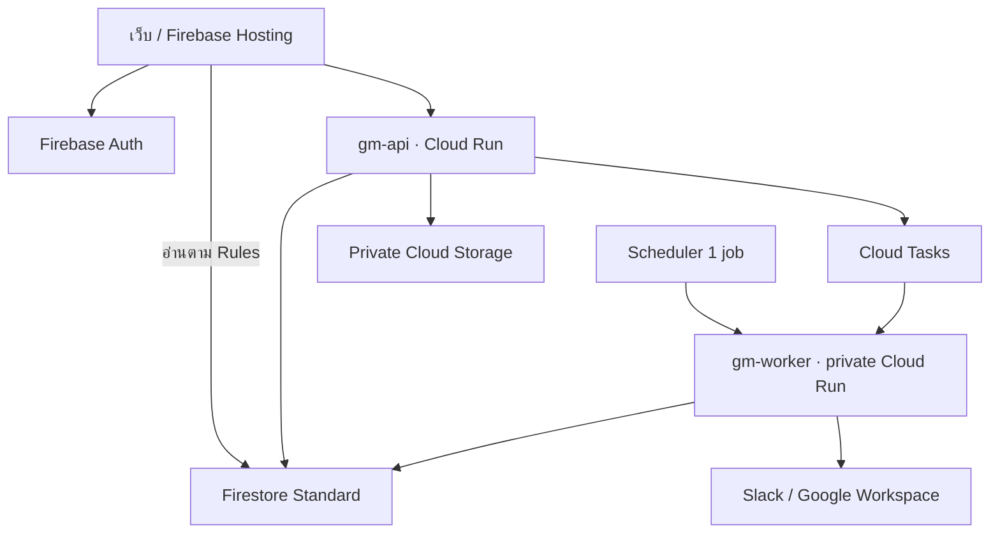

# UI spec เพิ่มเติม — ติดตามการต่ออายุเอกสาร

GM One Stop Service • ด่าน B • ร่าง Part 6 วันที่ 3 ตุลาคม 2569 • กู้คืนไฟล์วันที่ 4 ตุลาคม 2569 • เวลา Asia/Bangkok

ฐานข้อกำหนด: Part 1 — Changelog C1–C11 ฉบับยืนยัน, Addendum ของ Part 2–3, Part 4 — Patch, Part 5 — Patch F1–F6 และ infrastructure/budget/R1–R5 ล่าสุด เอกสารนี้กู้คืนจากร่างในบทสนทนา ไม่แก้ prototype ที่ตรวจผ่านแล้ว และยังไม่เริ่ม Part 7 ทั้งฉบับ

จุดที่ต้องอ่านให้ตรงกันก่อน:

- ย้ายเฉพาะ **การติดตามต่ออายุ** มา B; ทะเบียนเอกสารเต็มรูปแบบยัง Phase 2 และขอ/ส่งเอกสารอย่างง่าย US-04 ยัง B ตามเดิม
- คำว่า Cloud Function สำหรับ aggregate ใน C11 เปลี่ยนเป็น **backend บน Cloud Run** ตามทางเลือกที่อนุญาตล่าสุด หลักการ server คำนวณและจำกัดข้อมูลก่อนส่งยังเดิม
- R1 ยังไม่มี lead time ของใบรับรองมาตรฐาน: เสนอ **30 วันปฏิทิน** เป็น assumption ที่ Admin เปลี่ยนได้ก่อนใช้งาน
- “ต่ออายุค้าง” ใน Scorecard หมายถึง **ถึงวันเริ่มดำเนินการแล้วและรอบนั้นยังไม่จบ** ไม่ใช่เฉพาะหมดอายุ แสดง “เกินกำหนด” เป็นจำนวนย่อยแยกกัน

| หน้าจอ | สิ่งที่แสดง / การกระทำ | กติกา |
|---|---|---|
| รายการต่ออายุ `/gm/renewals` | เรียงวันหมดอายุใกล้ก่อน แบ่ง เกินกำหนด / ภายใน 30 วัน / 31–90 วัน / ปกติ; filter สถานที่ ผู้รับผิดชอบ ประเภท; เพิ่มรายการ และประวัติ | เฉพาะ `GM Staff` / `GM Admin`; desktop ตาราง มือถือรายการ; วันที่ พ.ศ. พร้อมวันปฏิทินที่เหลือ |
| เพิ่ม / แก้รายการ | ชื่อเอกสาร ประเภท หน่วยงาน/คู่สัญญา สถานที่หรือทั้งบริษัท วันหมดอายุ เริ่มล่วงหน้ากี่วัน ผู้รับผิดชอบ Drive link ที่เก็บตัวจริง ธงลับ | ประเภทเริ่มว่าง; owner เริ่ม Gorawit; เปลี่ยนประเภทเติม default เฉพาะเมื่อยังไม่แก้ lead เอง; แสดงวันเริ่มที่คำนวณแล้ว |
| รายละเอียดรายการ | ข้อมูลปัจจุบัน งานรอบปัจจุบัน ประวัติแต่ละรอบ ผลแจ้งเตือน | เปิดเลขงานไปหน้ารายละเอียด Request เดิม ไม่สร้างหน้าทำงานอีกชุด |
| ปิดงานต่ออายุ | “ต่ออายุแล้ว” ต้องกรอกวันหมดอายุใหม่ ลิงก์ใหม่ไม่บังคับ หรือ “ไม่ต่ออายุ” ต้องมีเหตุผล | ตรวจ server ทุกช่องทาง; จบรอบเก่าและเลื่อนไปรอบใหม่ หรือเก็บรายการเข้าประวัติ |
| นำเข้า CSV | Admin อัปโหลด → จับคู่คอลัมน์ → preview ค่าเดิม/ค่าที่แปลง → ตรวจแถวผิด/ซ้ำ → ยืนยัน | เน้นปี พ.ศ. ที่แปลง เช่น 2570 → 2027; ไม่บันทึกก่อนยืนยัน; ไม่รวมรายการจากชื่อคล้ายกันอัตโนมัติ |
| Scorecard | “สัญญา / ต่ออายุค้าง”: ทั้งหมด X, เกินกำหนด Y, ข้อมูล ณ เวลา… | นับทุกประเภทในระบบต่ออายุ; GM ชุดเต็ม; `Viewer` เฉพาะข้อมูลเปิดเผยได้พร้อมป้ายขอบเขต |

ค่าเริ่มต้น lead time: สัญญา 90 / ใบอนุญาตหรือเอกสารภาครัฐ 60 / ประกันภัย 45 / อื่นๆ 30 วันปฏิทิน; ใบรับรองมาตรฐาน 30 วันเป็น assumption สัญญาเปิดธงลับเริ่มต้น ใบอนุญาตภาครัฐไม่ลับเริ่มต้น การปลดธงต้อง `GM Admin` พร้อมเหตุผล

งานอัตโนมัติใช้ชื่อ `ต่ออายุ: [ชื่อเอกสาร]` ชื่อรายการไม่ลับต้องเปิดเผยได้ ข้อมูลคู่สัญญา เลขเอกสาร Drive link และที่เก็บตัวจริงไม่อยู่บนบอร์ดสรุป ผู้เกี่ยวข้องที่เปิดงานได้ไม่ได้สิทธิ์เปิดทะเบียนทั้งรายการหรือไฟล์ใน Drive อัตโนมัติ

---

# Part 6 — Technical architecture, data model, security & operating cost

## 6.1 ข้อเสนอหลักและ assumptions

ใช้ **React + TypeScript บน Firebase Hosting, Firestore Standard และ Cloud Storage**; backend TypeScript บน **Cloud Run แบบ request-based, min instances = 0** ใช้ project ของระบบนี้แยก dev/prod ใต้ organization และ billing เดิม ไม่เพิ่มบัญชีหรือ SaaS

| เรื่องที่ยังไม่ทราบ | Assumption สำหรับเอกสารนี้ | ผู้ยืนยัน |
|---|---|---|
| วิธี deploy ของพี่ทิม | Docker image → Artifact Registry → Cloud Run ผ่านคำสั่งหรือ pipeline เดิม | พี่ทิม; หากใช้ Functions CLI เป็นหลักให้เปลี่ยน adapter ตาม §6.2 |
| Project IDs | เสนอ `tdfb-gm-dev` / `tdfb-gm-prod`; ยังไม่ตรวจความว่าง/ไม่ได้สร้าง | พี่ทิม |
| Domain | `gm.tdfb.co` prod, `gm-dev.tdfb.co` dev | พี่ทิม/ผู้ดูแล DNS; ยืนยันก่อนพิมพ์ QR |
| Region | `asia-southeast1` Singapore สำหรับ Firestore, Run, Tasks และ bucket หลัก | พี่ทิม; ใกล้ไทย ไม่ได้อ้างว่าใกล้ที่สุด |
| ผู้ใช้ | 100 คน รวม GM 3 คน | GM |
| งานใหม่ | 20 งาน/วันทำการ × 22 วัน = 440 งาน/เดือน รวม `gm_task`/งานต่ออายุ | GM |
| รายการต่ออายุ | 200 รายการตั้งต้นเพื่อประเมิน query/import | Gorawit |
| รูป | เฉลี่ย 2 รูป/งาน หลังย่อเฉลี่ย 0.5 MiB/รูป | วัดใน pilot |
| Slack plan / quota ร่วม | ยังไม่ทราบ จึงคิดทั้งกรณี free quota เหลือและหมดแล้ว | Slack Admin / พี่ทิม |
| ผู้ส่ง email | mailbox มี license เดิม พร้อม alias เช่น `gm-notify@tdfb.co`; ยังไม่ถือว่ามีจริง | Workspace Admin |
| รายชื่อพนักงาน | A ใช้ CSV ที่ Admin export จาก Workspace แล้วเติม Slack user ID | Workspace Admin; Directory API ไม่เป็น gate ของ pilot |
| URL ชีทและ CSV จริง | ยังไม่ได้รับ รอ URL จริงของชีทที่ระบุชื่อไว้ | `GM Admin` |
| เวลาเช้า | 09: 00 Asia/Bangkok; tick ทุก 15 นาทีจึงอาจส่ง 09: 00–09: 15 | ค่าเริ่มต้นเสนอ; digest ตั้งเวลาได้ |
| ใบรับรองมาตรฐาน | เริ่มล่วงหน้า 30 วันปฏิทิน | `GM Admin` |
| อัตราวางงบ | 35 บาท/USD ไม่ใช่อัตราแลกเปลี่ยนปัจจุบัน | ใช้ราคาสกุลเงินจริงใน billing |
| Regional SKU | ราคาที่ดึงได้บางตารางแสดง default US; ค่า Singapore บางรายการใน §6.12 เป็น assumption/allowance แยกชัดเจน | พี่ทิมล็อก regional SKU และส่วนลดก่อน deploy |

**Firestore location เปลี่ยนหลังสร้าง database ไม่ได้** ยืนยันก่อนสร้าง `(default)` ของแต่ละ project [S01] ใช้ Firebase Blaze ที่ผูก billing เดิม; free quota ไม่ได้หมายความว่าใช้ Spark กับ backend/Storage โครงนี้ได้ [S02]

## 6.2 Architecture และเหตุผลที่เลือก Cloud Run

| ทางเลือก | ผลต่อทีมเล็ก | ข้อสรุป |
|---|---|---|
| Cloud Run services | ใช้ container/pipeline แบบบริษัท รวม domain logic ใน codebase เดียว แยก public API กับ private worker | แผนหลักภายใต้ assumption วิธี deploy |
| Cloud Functions 2 nd gen | เหมาะเมื่อใช้ Firebase CLI/functions อยู่แล้ว แต่ต้องจัดการ trigger/deployment และป้องกัน document-trigger loop | เปลี่ยน deployment adapter ได้เมื่อพี่ทิมยืนยัน ยังใช้ scheduler เดียวและ domain/time ชุดเดิม |

ไม่ผสมสองแบบใน Phase 1 โดยไม่มีเหตุจำเป็น worker คือ **Cloud Run service ปกติที่รับ HTTP** ไม่ใช่ worker pool หรือ CPU ที่เปิดค้าง



- `gm-api`: รับ command จากเว็บ, Slack interactive, Trello webhook เปิดรับ HTTPS แต่ตรวจ Firebase token หรือ provider signature แยกตาม route; public endpoint ไม่ใช่ public data
- `gm-worker`: IAM-authenticated เท่านั้น รับ Tasks/Scheduler ด้วย OIDC จาก service account ที่กำหนด ไม่มี public `/internal/tick`
- image เดียวต่าง entrypoint; API เริ่ม 1 vCPU/512 MiB, concurrency 20, max instances 3; worker 1 vCPU/512 MiB, concurrency 4, max instances 1; ทั้งสอง min= 0 ต้องวัดค่าจริงก่อนขยาย
- Cloud Tasks 1 queue/environment สำหรับ post-transaction work และ retry จำกัดอัตรา; prod Scheduler **1 job** `*/15 * * * *`, timezone Asia/Bangkok; dev manual tick/emulator ไม่สร้าง paused job ทิ้ง
- Hosting เสิร์ฟ static SPA และ rewrite `/api/**` ไป Run; Singapore รองรับ rewrite ตามเอกสาร [S03] ไม่มี load balancer, Cloud SQL, Memorystore, VPC connector หรือ NAT เพิ่ม
- Callback และ QR ใช้ custom domain; `/q/:qr_id` เป็น route ถาวร ไม่ฝังชื่อห้อง/วันหมดอายุใน QR และไม่ใช้บริการ QR รายเดือน
- ไม่มี cron timer ใน Run process และไม่มี fire-and-forget หลังตอบ HTTP งานที่ต้องทนต่อ instance หยุดอยู่ใน `outbox`/queue

## 6.3 Stack และขอบเขตโค้ด

Frontend: React, TypeScript, Vite, Tailwind รุ่นที่ prototype ตรวจแล้วพร้อม lockfile ใช้ tokens และ F1–F6 เดิม ไอคอน/ฟอนต์/ไลบรารีต้องใช้ได้ฟรีตาม license ไม่ซื้อ UI kit หรือ motion package

entry ตาม P1; ห้าม application CSS นอก cascade layer:

```css
@import "tailwindcss";
@import "./tokens.css" layer(components);
@config "./tailwind.config.cjs";
```

โครง repository ที่เสนอ: `apps/web`, `apps/api`, `apps/worker`, `packages/domain`, `packages/time`, `packages/contracts`, `infra`, `tests` ยังไม่ได้สร้าง implementation ในรอบนี้

- domain: transitions, ACL, `waiting`, renewal cycle, notification decisions, scorecard definitions
- time: pure functions ไม่มี Firestore/HTTP/เวลาจากเครื่องแฝง รับ `now` และ calendar snapshot เป็น input
- contracts: schema/validation ร่วม; frontend ช่วยกรอก server ตัดสินผลจริง
- infra: manifests, Rules/indexes, Hosting rewrites, IAM matrix, env template ไม่มี secret
- Vitest สำหรับ time/domain, Firebase Emulator Suite สำหรับ Rules/transactions, Playwright/local Chromium สำหรับ flow/layout ไม่เพิ่ม paid test service

feature flags แยก A/B ฝั่ง server; A เปิดได้เมื่อ SLA, full Dashboard, renewal import และ Trello ปิดอยู่ ไม่มี dependency ของ pilot ไป B

## 6.4 Data model และขอบเขตการอ่าน

Firestore **Standard** ใช้ database แรก `(default)` ต่อ project ไม่มี named database เพิ่ม งานใช้ opaque ID ส่วนเลขอ่านออกเสียงเป็น `request_number`

| Collection / path | ข้อมูล | การอ่าน |
|---|---|---|
| `request_summaries/{id}` | safe summary ของงานไม่ลับเท่านั้น | corporate `active` user |
| `requests/{id}` | รายละเอียด, ACL, clocks, `requester`/related/watchers | GM หรือ `requester`/related `person` |
| `gm_request_summaries/{id}` | projection บอร์ด GM รวมงานลับ/stale/delivery badge | GM |
| `requests/{id}/history/{event_id}` | `history` ที่ผู้มีสิทธิ์รายละเอียดอ่านได้ | API ตรวจ parent ACL ปัจจุบัน |
| `requests/{id}/comments/{id}` | คอมเมนต์/attachment refs | API ตรวจ parent ACL |
| `requests/{id}/gm_history/{event_id}` | watcher contribution และข้อมูลเฉพาะ GM | GM ผ่าน API |
| `requests/{id}/waiting_intervals/{id}` | แต่ละช่วงรอ `recipients`, start/respond/end | API ตามสิทธิ์รายละเอียด |
| `people/{person_id}` | ชื่อ email Slack ID `active` และ routing | server; Admin ผ่าน API ไม่แจก email/Slack IDs ทั้งชุด |
| `people_picker/{person_id}` | ID ชื่อ `team` label ที่จำเป็น | `active` user; label ไม่ใช่สมาชิกทีมเพื่อ ACL |
| `access/{firebase_uid}` | `person_id`, `role`, `enabled` | เจ้าของอ่านตน; server จัดการ; Rules ใช้ `active` `role` |
| `gm_profiles/{person_id}` | `focus_request_id`, `presence_status`, `presence_updated_at`, `leave_ends_on` | GM/เจ้าของผ่าน API |
| `gm_profile_summaries/{person_id}` | safe presence/focus | corporate user; secret focus เป็น “งานภายใน” ไม่มี secret ID |
| `user_state/{person_id}/requests/{id}` | reference, `last_viewed_at`, `last_seen_activity_seq`, relation `type`; ไม่มีชื่อ/รายละเอียดลับซ้ำ | เจ้าของ; API ตรวจ ACL ปัจจุบันก่อนคืนสรุปหน้า “ของฉัน” |
| `locations`, `areas`, `qr_codes` | 5 สถานที่ บริเวณ QR mapping | `active` user; ก่อน login คืนเพียง safe QR context ผ่าน API |
| `calendars`, `sla_policies`, `settings` | default ปัจจุบัน ไม่มี version registry | อ่านค่าที่จำเป็นตามสิทธิ์; `GM Admin` แก้ผ่าน API |
| `content_pages`, `announcements` | ติดต่อ GM/FAQ, ประกาศ B | `active` user; pre-login contact เป็น safe subset |
| `renewal_items/{id}` | รายการต่ออายุปัจจุบัน | GM |
| `renewal_items/{id}/cycles/{cycle_id}` | snapshot และผลแต่ละรอบ | GM |
| `dashboard_public`, `dashboard_gm`, `scorecards` | aggregate scope/`as_of`/definition/`visibility_epoch` | ผ่าน API ตรวจ `role`+ epoch; client ไม่อ่าน cache ตรง; official scorecard เฉพาะ GM |
| `commands`, `outbox`, `scheduled_work`, `system_counters`, `imports`, `integration_inbox`, `integration_state` | idempotency, delivery, due jobs, import/mapping | server เท่านั้น; Admin ดู safe `status` ผ่าน API |

### 6.4.1 Canonical request fields

| กลุ่ม | Keys และกติกา |
|---|---|
| ตัวตน | `request_number`, `type`, `source`, `origin`, `created_by_id`, `created_at` |
| ผู้ขอ | `requester_id` เฉพาะผู้ขอจริง; `requester_name_text` สำหรับเปิดแทนข้อความ; **`gm_task` ไม่มี `requester_id`** |
| เนื้อหา | `summary_title`, `description`, `category`, `location_id`, `area_id`, `symptom_key`, `attachment_ids` |
| มอบหมาย | `assignee_id` nullable = ยังไม่มอบหมาย |
| สิทธิ์ | `is_confidential`, `sensitivity_reason`, `related_person_ids`, `watcher_ids`; `team_labels` ไม่มีผล ACL |
| สถานะ | `status` = `queued` / `in_progress` / `waiting` / `completed` / `cancelled`; `revision` กันชน |
| เวลา | `last_updated_at` = ความคืบหน้า GM; `updated_at` = เทคนิค; `last_activity_at`/`activity_seq` = unread |
| รอบปิด | `completion_cycle_id`, `completed_at`, `closed_at`, `closure_kind`, `cancelled_at`, `auto_close_due_at`; รอบเก่าใน `history` |
| รอ | `waiting_on`, `current_waiting_interval_id`, `waiting_since`, `waiting_party_responded`, `responded_at` |
| SLA | `sla_snapshot`, `planned_due_at`, `planned_due_reason`, `sla_breached_at`, `coordinate_at` / milestone `history` |
| ปฏิทิน | `work_calendar_snapshot`, `confirmation_calendar_snapshot`; SLA calendar snapshot ตาม §6.7 |
| ต่ออายุ | `renewal_item_id`, `renewal_cycle_id` |

`type = maintenance | gm_task | document_request | document_intake`; `source = web | trello`; `origin = requester | gm_on_behalf | gm_initiated` ห้ามนำ `internal_task` หรือ `related_team_ids` กลับมาใช้

Public serializer เป็น allowlist: request ID/number, `summary_title`, `type`/`category`, safe location/area/symptom, `status`, assignee label, `waiting_on_summary`, public timestamps/closed/`cancelled` flags, `watcher_count`, `source` และ Trello link ที่อนุมัติแล้ว ไม่ copy `requests` ทั้งก้อน

ห้าม public: `description`, `requester` identity, `related_person_ids`, `watcher_ids`, `comments`/photos/files/`history`, Slack/email IDs, `sensitivity_reason`, Drive link, ที่เก็บตัวจริง, raw `waiting` note และ free text ที่ไม่ตรวจ ชื่อฝ่ายภายนอกใช้ safe label ที่ GM ยืนยัน หรือ generic `kind` เช่น “หน่วยงานรัฐ”

งานลับไม่มี document ใน `request_summaries` มีเพียง `internal_board_count` รวมทั้งบริษัทตามกรอบบอร์ด ไม่แจกแจงตาม filter การติดธงลับลบ summary, ปรับ safe home counter/focus และเพิ่ม `public_visibility_epoch` ใน transaction เดียวก่อนตอบสำเร็จ API ไม่คืน aggregate cache epoch เก่า ไม่รอ scheduler และไม่ต้องไล่แก้ cache ทุก filter ใน transaction

หน้าแรกเริ่มจาก safe focus; endpoint ส่วนบุคคลตรวจ ACL แล้วคืนชื่อ focus เฉพาะผู้มีสิทธิ์ งานปิด/ยกเลิกปลด focus และใช้ fallback `in_progress` ล่าสุดของ GM คนนั้น ถ้าไม่มี “ยังไม่มีงานที่กำลังทำ” ไม่ให้ secret request ID ผ่าน public profile

`maintenance` สร้าง `summary_title` ฝั่ง server เป็น “[อาการ] — [บริเวณ] · [สถานที่]” หรือ “[อาการ] · [สถานที่]”; `requester` แก้ไม่ได้ ข้อความพิมพ์อยู่ในรายละเอียด GM แก้ชื่อได้โดยยังต้องเปิดเผยได้

### 6.4.2 Watcher และ unread

- เพิ่ม watcher ด้วย transaction/`arrayUnion`; คนเดิมกดซ้ำไม่เพิ่ม count/Request/related `person`; `requester` ตัวจริงไม่นับเป็นผู้แจ้งเพิ่มของตัวเอง
- watcher อ่านเฉพาะ summary ไม่ได้ `requests`/`history`/files; เปลี่ยนเป็นลับแล้วหยุดส่ง summary และซ่อนพื้นที่ส่วนตัวของคนที่ไม่มี ACL
- note/photos เพิ่มได้หนึ่ง contribution ต่อคนต่องานใน `gm_history`; upload retry ผูก contribution เดิม ไม่เปิดอ่านรูปของผู้อื่น
- `activity_seq` เดินเฉพาะ event ที่ผู้ดูมีสิทธิ์เห็น; watcher ใช้ public/`status` sequence ไม่ใช้ technical `updated_at` หรือ notification เป็น unread
- เปิดดูสำเร็จแล้วบันทึก `last_seen_activity_seq`; หน้าแรกนับ `completed` ที่ `requester` ยังต้องยืนยันเป็น “มี X งานรอคุณยืนยัน”; คำขอของฉันมีจุดอัปเดต ไม่มี notification center ใหม่

### 6.4.3 Renewal item และ cycle

```ts
type RenewalItem = {
  document_name: string;
  document_type: 'contract' | 'government_document' | 'insurance'
    | 'standard_certificate' | 'other';
  counterparty_name: string;
  location_scope: 'company' | 'locations';
  location_ids: string[];
  expires_on: string;           // YYYY-MM-DD ค.ศ. date-only
  lead_days: number;            // จำนวนเต็ม วันปฏิทิน
  start_on: string;             // expires_on - lead_days
  owner_id: string;             // default person_id Gorawit
  document_drive_url?: string;
  original_storage_location?: string;
  is_confidential: boolean;
  sensitivity_reason?: string;
  state: 'active' | 'archived';
  current_cycle_id: string;
  current_request_id?: string;
  revision: number;
  created_by_id: string;
  created_at: Timestamp;
  updated_at: Timestamp;
  archived_at?: Timestamp;
  archive_reason?: string;
  import_batch_id?: string;
  external_ref?: string;
};
```

ชื่อ ประเภท วันหมดอายุ lead owner และ location scope ต้องครบ; หากไม่รู้หน่วยงาน/คู่สัญญาให้เลือก “ไม่ระบุ” ชัดเจน ไม่เดา Drive/ที่เก็บตัวจริงเก็บเท่าที่มี ไม่ขยายเป็นทะเบียนเต็มรูปแบบ

cycle เก็บ `cycle_id`/`cycle_number`, snapshot `expires_on`/`lead_days`/owner/`locations`/confidentiality, `request_id`, `opened_at`, `resolved_at`, `outcome=renewed|not_renewed`, `new_expires_on`, optional new link และเหตุผล รหัสรอบคงที่ ไม่ใช้วันหมดอายุที่แก้ได้เป็น ID

แก้วันหมดอายุ/lead ของรอบที่มีงานแล้วให้ปรับกำหนด/reminders ของงานเดิมพร้อม audit ไม่สร้างงานใหม่ และไม่ทำให้งานที่เริ่มแล้วหายไปเมื่อเลื่อน `start_on` ไปอนาคต

## 6.5 Authentication, authorization และ Security Rules

ตรวจ Google token กับ project ถูกตัว, provider Google, verified email @tdfb.co และ employee `active`; `hd` ที่หน้า login เป็นตัวช่วย ไม่ใช่ ACL

ใช้ `person_id` คงที่แยก Firebase UID เพื่อเลือกพนักงานก่อน login ครั้งแรกได้ ตอน login server จับคู่ verified email กับรายชื่อ Admin เท่านั้น ชื่อข้อความไม่ถูก map เป็นบัญชีอัตโนมัติ

`role` authoritative ใน `access`/{uid}: `requester` / `gm_staff` / `gm_admin` / `viewer`; offboard ปิด `enabled` ไม่ต้องรอ custom claim หมดอายุ หาก claim ใช้วาดเมนูต้องไม่แทน active-role check

| การกระทำ | ทั่วไป / watcher | `requester` / related | `GM Staff` | `GM Admin` | `Viewer` |
|---|---|---|---|---|---|
| สรุปไม่ลับ | อ่าน | อ่าน | อ่าน | อ่าน | อ่าน |
| รายละเอียด | ไม่ได้เพียงเพราะเห็น summary | อ่าน/คอมเมนต์ตาม ACL | อ่าน/จัดการ | อ่าน/จัดการ | `role` อย่างเดียวไม่ได้; explicit related ให้สิทธิ์เฉพาะงานตาม Part 2 |
| เปลี่ยน `status` | ไม่ได้ | `requester` ยืนยัน/แจ้งยังไม่เสร็จตาม flow; related เปลี่ยนไม่ได้ | ได้ | ได้ | ไม่ได้จาก `role` |
| ฝ่ายรอตอบ | เฉพาะ recipient ของ interval ปัจจุบันและมี ACL | เช่นเดียวกัน | ตาม flow GM | ตาม flow GM | ต้องเป็น recipient และมี ACL |
| ปลดธงลับ | ไม่ได้ | ไม่ได้ | ไม่ได้ | ได้+ reason | ไม่ได้ |
| renewal register | ไม่ได้ | related ของงานไม่เปิดทะเบียน | อ่าน/เพิ่ม/แก้/ปิดรอบ | เพิ่ม import/`settings`/archive correction | ไม่ได้ |
| Dashboard/CSV | ไม่มี full Dashboard | relation ไม่เพิ่มสิทธิ์ Dashboard | full scope | full scope | public scope |

Rules อ่านทั้ง document จึงป้องกันราย field ใน document เดียวไม่ได้ [S04] นโยบายต่อไปนี้เป็น pseudocode ไม่ใช่ Rules ที่อ้างว่าพร้อม deploy:

```text
isActive = verified corporate Google login AND access[current_uid].enabled
isGM = isActive AND access.role in {gm_staff, gm_admin}
canReadRequest = isGM
  OR (isActive AND resource.requester_id == access.person_id)
  OR (isActive AND access.person_id in resource.related_person_ids)

request_summaries: active employee read; client writes denied
gm_request_summaries / renewal_items: GM read; client writes denied
requests: canReadRequest; client writes denied
user_state/{person_id}: owner read; client writes denied
access/{uid}: self read; client writes denied
aggregate caches: client read/write denied; API checks scope + epoch
safe home counters/profiles: active employee read; client writes denied
outbox/counters/imports/system and unmatched paths: client access denied
```

ใช้ get(`access`/`current_uid`) เป็น dependency เดียวเพื่อ revoke/เปลี่ยน `role` ทันที ACL ของงานอยู่ใน document ที่ตรวจ ไม่อ่านสมาชิกทีม/รายชื่อผู้เกี่ยวข้องทีละคน Rules dependency reads มีค่าใช้จ่าย รวมไว้ในงบ และไม่ถือว่า client cache ทำให้ฟรีเสมอ [S05]

`history`/`comments` ผ่าน API ตรวจ parent ACL ปัจจุบัน ไม่ copy ACL ทุก event หรือเปิด wildcard กว้าง Query ต้องสอดคล้อง Rules เพราะ Rules ไม่ได้กรองผลที่ไม่อนุญาตให้อัตโนมัติ

Admin SDK bypass Rules: API/worker ทุก command ต้องตรวจ actor/ACL/`role`/`source`/`revision`/transition ผ่าน domain service เดียวกัน ห้ามถือว่า UI ตรวจแล้วพอ client เขียน `status`/watchers/related/SLA/cycle/counter โดยตรงไม่ได้

ไม่ใส่ข้อมูลลับใน logs/error payload/analytics/URL query string ใช้ IDs/error codes แทน raw body Drive URL ใช้สิทธิ์ Drive เดิม ไม่แชร์อัตโนมัติ

## 6.6 Commands, เลขงาน และการชนกัน

ทุก mutation มี `Idempotency-Key` + actor + payload hash; key เดิม payload ต่าง reject; retry key เดิมคืนผลเดิม งานเดิมมี `expected_revision`; conflict คืนสถานะล่าสุด ไม่เขียนทับเงียบๆ

เลขงาน transaction เพิ่ม `system_counters`/`request_sequence` แล้วสร้าง `GM-` + padded อย่างน้อย 4 หลัก เช่น GM-0427/GM-10000 ต่อเนื่องต่อ environment ไม่ reset ทุกปี ไม่ reuse เลขยกเลิก/ลบ dev ติดป้ายชัดและไม่แจ้งคนจริง ไม่รับประกันเลขไร้ช่องว่างจาก migration/การเก็บประวัติ

| Command | Guard / ผล |
|---|---|
| `createMaintenance` | location/area/symptom valid, server title; recheck duplicate ก่อน commit; ยังเลือกแจ้งใหม่ได้ |
| `watchRequest` | non-secret open `maintenance`; unique watcher+ contribution; งานเพิ่งปิด/ลับคืน latest |
| `createGmTask` | GM, `category` เลือกเอง 1 ใน 7, `origin` `gm_initiated`, ไม่มี `requester_id`; initial `waiting` ต้องครบ |
| `createOnBehalf` | GM เป็น `created_by`; `requester` จริงจาก directory หรือชื่อข้อความ; ยืนยันตามการมี `requester_id` |
| `assign` / `accept` | assignee/`status`/`last_updated_at`; ตรวจ effective leave ณ server now |
| `enterWaiting` / `changeWaitingParty` | ปิด interval เดิม เปิดใหม่; preview `recipients`/ACL; secret separate consent; `outbox` ผูก interval |
| `followUp` | `history` + `last_updated_at` แตะเดียว; optional resend key ต่องานต่อ business-date bucket |
| `respondWaitingParty` | recipient ปัจจุบัน + ACL, first valid response wins; ไม่แก้ `status`/`last_updated_at` |
| `coordinateTechnician` | event แยกจากรับเรื่อง; A เก็บข้อเท็จจริง B ใช้ SLA milestone |
| `complete` | สรุปผลครบ; มี `requester` → รอยืนยัน; `gm_task`/ชื่อข้อความ → ปิดทันที; renewal มี guard เพิ่ม |
| `confirm` / `notResolved` | `requester` ตัวจริง + completion cycle ปัจจุบัน; watcher ไม่ได้; `notResolved` กลับ `in_progress` |
| `cancel` / `reopen` | GM+ reason คง `history`/breach; renewal ใช้ flow เฉพาะ §6.8 |
| `completeRenewal` / `stopRenewal` | transaction item+ cycle+ request เดียวกัน |
| `setFocus` / `setPresence` | สิทธิ์เจ้าของ GM/Admin; focus `in_progress` 1 งาน; ไม่ reset stale |
| `importRenewals` | `GM Admin`, preview hash ตรงไฟล์ที่ยืนยัน; commit ซ้ำไม่เพิ่ม |

transaction เขียนงาน/projection/`history`/`outbox` ร่วมกัน **ไม่เรียก Slack/email ใน transaction** เพราะ retry ได้ หลัง commit จึง enqueue Task หาก enqueue ล้มเหลว Scheduler recovery รับต่อ

7 หมวดเดิม: บริหารสินค้า Damage / เอกสารและธุรการ / ทรัพย์สินและอาคารสถานที่ / จัดซื้อทั่วไปและบิล / ภาครัฐ กฎหมาย Compliance / Project ปรับปรุงระบบ / กิจกรรมพนักงาน งานต่ออายุอัตโนมัติใช้ Admin mapping (เสนอเอกสารและธุรการ) แยกจาก manual form ที่ต้องเริ่มว่าง

## 6.7 เวลาทุกชนิดใช้ pure functions ชุดเดียว

timestamps เป็น UTC แสดง Asia/Bangkok; วันหยุด/หมดอายุ date-only YYYY-MM-DD ค.ศ. ไม่เก็บ พ.ศ. เป็นค่าหลัก Display ปัดลง แต่การตัดสินใช้ raw value

```text
businessDuration(start, end, calendarSnapshot)
addBusinessDuration(start, duration, calendarSnapshot)
mergeIntervals(intervals)
effectiveWaitingEnd(interval, now)
slaElapsed(request, now)
staleState(request, now)
autoCloseDue(completedAt, calendarSnapshot)
renewalStartOn(expiresOn, leadDays)
nextWorkingMorning(date, calendarSnapshot, localTime)
formatBusinessDuration(rawDuration, context)
```

| Clock | นิยาม |
|---|---|
| วันทำการ | สะสม 24 ชั่วโมงเฉพาะวันที่เปิดทำการ ไม่ใช่กะ/8 ชั่วโมง |
| อายุรวม | `created_at` → now/`closed_at`/`cancelled_at` เวลาจริง ไม่หักรอ/วันหยุด; เปิดกลับอ้างวันสร้างเดิม |
| SLA GM | `duration` จาก snapshot หัก union ของช่วงพัก; `waiting` พักถึง `responded_at` หรือออกจากรอ แล้วแต่อะไรก่อน |
| รอรายฝ่าย | เก็บ interval เวลาจริง และคำนวณ business `duration` เพื่อกราฟตาม F4 ใช้ effective end เดียวกับ SLA pause |
| stale | เฉพาะ `queued`/`in_progress`/`waiting` เมื่อ **เกิน** 3 วันทำการจาก `last_updated_at`; `waiting` ไม่พัก |
| auto-close | `completed` มี `requester` ยังไม่ตอบเมื่อ **ครบ** 3 วันทำการ; `closed_at` เป็นเวลาปิดจริง เก็บ due เดิม |
| หมดอายุ | วันปฏิทิน ใช้ได้จนจบ `expires_on`; overdue วันถัดไป 00: 00 ไทย |

snapshot ปฏิทิน copy timezone/weekday mask/holidays พร้อม hash/`source` reference เข้างาน ไม่อ่าน mutable calendar ทุกครั้ง และไม่มี version registry

`sla_snapshot` คง C8: `policy_key`, `milestone_type`, `duration`, `unit`, `calendar_ref`, `started_at`, `original_due_at`; เพิ่ม **`calendar_snapshot`** immutable เพื่อให้ `calendar_ref` เป็น provenance งาน A เก็บ work calendar บริษัทตั้งแต่สร้าง B ใช้สถานที่ ไม่มีสถานที่ใช้บริษัท `confirmation_calendar_snapshot` copy ปฏิทินที่ใช้กับงานเมื่อเริ่มรอยืนยัน

แก้ default policy/calendar ใช้กับงานใหม่ ไม่ rebase งานเก่าเงียบๆ Production ต้องใส่วันหยุด ธ.ค.2569–ม.ค.2570 ก่อน pilot และตรวจความครอบคลุมทุกปี

B เริ่ม SLA สองแบบ: ไฟดับ/อินเทอร์เน็ตล่ม `coordinate` 1 `business_day` และ `maintenance` ทั่วไป `resolve` ตาม Admin ประเภทอื่น “ยังไม่กำหนด SLA” ผูกเกณฑ์ภายหลังเริ่ม `created_at` และหักประวัติรอจริง ไม่เริ่มใหม่วันที่ผูก

`original_due_at` เป็น baseline `started_at`+ budget เดิมและคงที่ `effective_due_at` คำนวณหลังพักเพื่อแสดงผล `planned_due_at` เป็นแผนใหม่พร้อมเหตุผล ผล SLA เทียบ **`active` elapsed กับ budget เดิม** ไม่เทียบ wall-clock กับ baseline จนลงโทษช่วงรอ และไม่ให้แผนใหม่ล้าง breach

response หยุดการคิดเวลาฝ่ายที่รอทันทีแม้ `status` ยัง `waiting` ช่วงหลัง response ถึง GM กลับมาทำต่อ SLA GM เดิน ไม่พักเพิ่มเพราะ scheduler ช้า `sla_breached_at` อ้างเวลาข้าม budget จริง คงเมื่อ `cancel`/`reopen`; `resolve` หยุดตอน `complete` ระหว่างรอยืนยัน เปิดกลับใช้เวลาที่ใช้แล้วต่อ

| Unit-test case ตั้งแต่ A | Expected |
|---|---|
| จ–ศ ไม่มีวันหยุด ศุกร์ 2 ต.ค.2026 16: 00 + 1 BD | จันทร์ 5 ต.ค.16: 00 |
| เริ่มเดียวกัน + `continuous_24h` 1 วัน | เสาร์ 3 ต.ค.16: 00 |
| เสาร์ 3 ต.ค.12: 00 + 1 BD | อังคาร 6 ต.ค.00: 00 |
| `complete` 28 ธ.ค.2026 09: 30; หยุด 31 ธ.ค./1 ม.ค.+ส–อา | auto-close due 4 ม.ค.2027 09: 30 |
| elapsed 3 BD พอดี /3 BD+ 1 ms | stale `false`/`true`; auto-close ครบแล้ว `true` |
| budget24 h เริ่มจันทร์ 09: 00 รอ 12: 00 ตอบอังคาร 12: 00 GM กลับ 15: 00 | wait จบอังคาร 12: 00, ช่วง 12–15 นับ GM, effective due พุธ 09: 00 ถ้าไม่พักอีก |
| รอ A→รอ B→B ตอบ→GM กลับ | แยก interval ไม่บวกซ้ำ/ไม่พักหลังตอบ; callback A เก่า reject |
| `requester` comment / watcher / pin / notification | activity เฉพาะผู้เห็นได้; `last_updated_at` ไม่เปลี่ยน |
| GM `followUp` ขณะ `waiting` | stale reset; เวลารอสะสมไม่ล้าง |
| raw0.4 /4.9 BD | “ไม่ถึง 1 วันทำการ” /“4 วันทำการ”; raw ยังเดิม |

Last update ใช้ “อัปเดตล่าสุดไม่ถึง 1 วันทำการที่แล้ว” หรือ “อัปเดตล่าสุด X วันทำการที่แล้ว” คงคำว่า “ที่แล้ว” เวลารอใช้ “ไม่ถึง 1 วันทำการ”; “วันนี้” ใช้เฉพาะ context วันที่เกิดวันนี้จริง GM เห็น “ไม่ขยับ X วันทำการ · ถึงเวลาติดตาม” คนอื่นข้อความกลาง

## 6.8 Lifecycle ต่ออายุและ Scorecard

### สร้างงานและเตือน

1. `start_on = expires_on - lead_days` วันปฏิทิน ถึงวันนั้นสร้างงานแม้วันหยุด เลื่อนเฉพาะ **การส่งแจ้ง** ไม่เลื่อน `start_on`/overdue
2. transaction อ่าน item/cycle ตรวจ `active`/`current_cycle_id` ใช้ request ID คงที่จาก hash(`item_id`+ `cycle_id`) ตรวจงานเดิมและออกเลขงานครั้งเดียว
3. สร้าง `type`= `gm_task`, `origin`= `gm_initiated`, `source`= `web`, ไม่มี `requester_id`; `created_by_id` เป็น service actor เช่น `system:renewals` พร้อม `actor_kind`= `system` ไม่ปลอมว่า Gorawit กดสร้าง
4. ชื่อ `ต่ออายุ: [ชื่อเอกสาร]` copy confidentiality/สถานที่/หมวดตาม mapping; owner เริ่ม Gorawit หากลาตอนสร้าง งาน **ยังไม่มอบหมาย** และแจ้ง GM ทุกคน owner ของรายการยังเดิม
5. due records ก่อนหมดอายุ 30/7 วัน และวันถัดจาก `expires_on` แจ้งเมื่อ current cycle ยังไม่จบ/งานยังไม่ปิด แก้ due แล้ว invalidate reminders `revision` เก่า
6. วันส่งตรงวันหยุดเลื่อน 09: 00 วันเปิดถัดไป; สถานที่เดียวใช้ปฏิทินนั้น ทั้งบริษัท/หลายสถานที่ใช้บริษัทเป็น assumption ไม่เลือกสถานที่แรกโดยพลการ
7. วันหยุด/ระบบล่มคร่อมหลาย threshold ให้รวมข้อความตามความเร่งด่วนล่าสุดและบันทึก threshold ที่รวม ไม่ส่ง “เหลือ 30 วัน” หลังหมดอายุ
8. วันหมดอายุผ่านแล้ว flag overdue ทันทีตาม date; แจ้ง `GM Admin` เช้าวันทำการถัดไป พร้อม owner หรือ GM ทุกคนเมื่อยังไม่มอบหมาย ไม่ส่งซ้ำทุก 15 นาที

dedupe สร้างงาน = item+ cycle; reminder = item+ cycle+ threshold+ `revision` พร้อม recheck ก่อนส่ง งานของ `revision` เก่าหรือรอบเก่าที่ค้างใน queue เป็น no-op รายการนำเข้าที่ถึง `start_on` แล้ว catch up สร้างเพียงงานเดียว

### ปิดรอบ

`completeRenewal` อ่าน item/cycle/request ใน transaction เดียว ตรวจ `new_expires_on` ถูกต้องและ **หลังวันหมดอายุเดิมและหลังวันนี้** การแก้ย้อนหลังใช้ `GM Admin` correction+ reason ไม่ผ่านเสร็จปกติ

ยืนยันแล้ว: งานเดิม `completed`+ `closed_at` ทันที, cycle `outcome` `renewed`, เก็บ previous values, ตั้ง `current_cycle_id` ใหม่และ `expires_on`/`start_on` ใหม่, ล้าง `current_request_id` สำหรับรอบใหม่, invalidate old reminders, เปิด schedule รอบใหม่ หาก `start_on` ใหม่ถึงแล้วสร้างผ่าน idempotent mechanism เดิม ไม่มี `requester` confirmation/auto-close

`stopRenewal`: reason บังคับ; `outcome` `not_renewed`, งาน `completed`+ `closed_at` และ `closure_kind` `not_renewed`, item `archived` เอาออกจากค้าง ไม่ถือว่า “ต่ออายุสำเร็จ” ในรายงานผลลัพธ์

ทุกทางรวมปุ่มเสร็จ/Slack/job ต้องผ่าน guard เดียวกัน Slack เปิดลิงก์แบบกรอกวันหมดอายุหากยังไม่ครบ คำสั่ง `cancel` ทั่วไปปฏิเสธงานที่ผูก current renewal cycle และพาไป “ไม่ต่ออายุ” หรือ Admin archive/correct กรณีข้อมูลผิด/ซ้ำ หากพบ legacy `cancelled` แต่ cycle `active` ให้ยังนับค้างและขึ้น error ให้ Admin ไม่หยุด overdue escalation เงียบๆ ห้าม `reopen` cycle เก่าหลังเริ่มรอบใหม่ด้วยการแก้ request อย่างเดียว

### Scorecard

```text
renewal_pending = จำนวน distinct item.current_cycle_id
  ที่ item.state == active
  AND item.start_on <= today_in_Bangkok
  AND current cycle ยังไม่มี outcome ที่จบรอบ

renewal_overdue = subset ของ renewal_pending
  ที่ today_in_Bangkok > item.expires_on
```

นับจาก item/cycle ไม่ใช่จำนวน `gm_task` จึงยังเห็นค้างแม้ job ไม่ได้สร้างงาน และไม่ double-count ช่วง `waiting` ไม่หยุด expiry/เอาออกจากฐาน ชื่อไทล์ “สัญญา / ต่ออายุค้าง” ครอบคลุมทุกประเภท R1; tooltip/CSV ต้องบอกนิยาม

GM full scope; `Viewer` count เฉพาะรายการไม่ลับ ไม่ได้เปิดทะเบียน ไม่มี secret breakdown ตาม filter และติดป้าย “เฉพาะข้อมูลที่เปิดเผยได้” จำนวน “งานภายใน” บนบอร์ดนับงานตามกรอบบอร์ด ไม่ใช่จำนวนรายการเอกสารลับทั้งหมด

B ไทล์นี้เปลี่ยนเป็นตัวเลขจริงพร้อมวันนำเข้าล่าสุด/ความครบถ้วน; เอกสารลงทะเบียนเกิน 3 วันและทรัพย์สินไม่ลงทะเบียนยัง “ยังไม่เชื่อมข้อมูล” พร้อมลิงก์ชีท ไม่ใช้ 0 แทนข้อมูลที่ไม่มี

### CSV import

- UTF-8 รองรับ BOM, header mapping, preview ก่อน commit เก็บ raw/normalized เทียบ `external_ref` ถ้ามี ไม่รวมจากชื่ออย่างเดียว
- normalize เลขไทย; รองรับ ISO และ d/m/yyyy ตาม format ที่เลือก; ปี 4 หลักตั้งแต่ 2400 ที่เข้าเงื่อนไข พ.ศ. เสนอหัก 543 แสดงค่าเดิมและค่าทั้งสองศักราชให้ยืนยัน
- ปี 2 หลัก/วันที่กำกวม/Excel serial/วันไม่มีจริง/field ไม่ครบเป็น error ให้แก้หรือเลือก format ไม่เดา เช่น 29/2/2569 ไม่เปลี่ยนเป็นวันอื่นเอง
- missing lead ใช้ default ตามประเภทและ highlight; missing owner เสนอ Gorawit; สัญญา missing confidential= `true` ทุก default เห็นก่อนยืนยัน
- ค่าเริ่มต้นให้แก้แถวผิดก่อน จะ import เฉพาะแถวถูกต้อง N แถวได้เมื่อยืนยันชัดพร้อม error report ไม่ข้ามเงียบๆ
- batch ID+ file hash+ stable row key กัน double submit; row transaction; chunk/resume พร้อมจำนวนสำเร็จ/ผิดจริง
- assumption pilot สูงสุด 1,000 แถว/ไฟล์ ตรวจ 100 แถว/chunk ปรับได้โดยไม่เพิ่ม SaaS
- Drive link รับ HTTPS จากโดเมน Drive/Docs ที่กำหนด ไม่ fetch arbitrary URL จาก CSV และไม่แก้ sharing

## 6.9 Scheduler เดียวและการรันซ้ำ

`/internal/tick` เรียกด้วย Scheduler SA อ่าน `scheduled_work` ที่ `next_run_at`<= now มี batch limit และ transaction lease ไม่ scan งาน/พนักงานทั้งหมดทุก 15 นาที ใช้ Tasks ต่อ batch ถ้างานยาว

| งานใน tick | การเลือก / กันซ้ำ |
|---|---|
| stale | schedule `addBusinessDuration(last_updated_at, 3BD+1ms)` ให้เป็นจุดแรกเกิน 3 BD ไม่บวก wall-clock1 ms บนขอบวันหยุด; recheck `status`/`revision`/raw clock |
| auto-close | request+ `completion_cycle_id`; ตรวจ `completed`, `closed_at` ว่าง, due ถึง, ไม่มี `notResolved` รอบใหม่ |
| presence reset | expiry; leave มี `leave_ends_on` คงจนสิ้นวันนั้น; leave ไม่มีวันสิ้นสุด reset สิ้นวันตามเดิม |
| digest | `person`+ local business date+เวลาเป็น key; ส่งเมื่อมีสถานที่รับผิดชอบเปิด; ACL ตอนส่ง |
| renewal create/remind/overdue | item+ cycle+ threshold+ `revision`; catch-up ด้วย<= now |
| `outbox` recovery | `pending` ไม่มี task/lease หมด; bounded backoff; ไม่ส่งเหตุการณ์ revoke/`cancel`/supersede |
| aggregate reconcile | dirty scope/period+ cursor ไม่ scan ทุก document ทุก tick |
| backup | วันละครั้งจาก tick เดิม วัน+ operation ID กัน export ซ้ำ ไม่มี Scheduler เพิ่ม |
| cleanup | batch จำกัด orphan uploads/technical records หมดอายุ; ไม่เปิด TTL เสียเงินเงียบๆ |

job เก็บ `attempts`/`lease_until`/`last_error_code`/`next_run_at`/`completed_at` หมด retry ให้ failure ที่ Admin เห็น lease หมดไม่ได้แปลว่าธุรกิจยังไม่เกิด ต้อง recheck transaction ก่อนทำซ้ำ

ไม่เขียนเมื่อค่าไม่เปลี่ยน เช่น stale= `true` ซ้ำ ห้าม scheduler อัปเดต `last_updated_at` tick 15 นาทีทำให้ side effect อาจช้า 15 นาที แต่ clock/expiry ใช้เวลาจริง

UI คำนวณ effective presence จาก expiry จึงไม่โชว์สถานะเมื่อวานระหว่างรอ tick ลาที่มีวันสิ้นสุดรวมวันนั้น assignment ตรวจ effective leave ขณะสร้าง ไม่รอ reset job ไม่ย้ายงานเดิมอัตโนมัติเมื่อเจ้าของเริ่มลา

## 6.10 Integrations, รูป, QR, search และ PWA

### Slack/email

A `outbox` แจ้งงานใหม่/สถานะเปลี่ยน/ฝ่ายที่รอ/ผลตอบกลับ B เพิ่ม actions/digest ผ่าน handlers เดิม

`waiting_on` คง `{kind: person|team|contractor|government|other, person_id?, team_label?, name?}` เก็บ `recipients` ใน interval แยกเพื่อสิทธิ์ตอบช่วงปัจจุบัน

- `kind`/`person` เริ่มว่าง; `team` contacts1–3 คน optional; เลือก `person` แล้ว default notify on; ก่อนเลือกไม่แสดง checkbox หรือข้อความเพิ่มสิทธิ์
- preview ผู้เพิ่ม `related_person_ids` ก่อน commit; secret มี separate confirmation; label ไม่ให้สิทธิ์ ไม่ DM ทั้งทีมด้วยการเดาสมาชิก
- ภายในจับคู่ Slack ได้ส่ง DM จับคู่ไม่ได้ใช้ email บริษัทจาก directory ไม่ส่งตาม free text
- Slack ล่มแต่มี mapping ให้ retry จำกัด+แสดง delivery `state`; fallback email หลัง fail ถาวรผ่าน command ที่ตรวจว่าไม่เคยสำเร็จ หากผลไม่แน่นอนเป็น `delivery_unknown` ให้ GM ตรวจ ไม่ส่งสองทางแบบเดา
- `contractor`/`government`/`other` ไม่ส่งอัตโนมัติ ไม่มีช่องทาง valid ขึ้น “ผู้ขอยังไม่ได้รับแจ้ง”; provider accepted ไม่เท่ากับอ่านแล้ว
- secret ทั้ง Slack/email มีเพียงเลขงาน ข้อความกลาง ลิงก์; watcher ได้ public summary เท่านั้น ไม่มีรูป/รายละเอียดแนบ
- resend ใช้ request+ business-date bucket จำกัด 1 ครั้ง วันหยุดจัดเข้าวันทำการถัดไปไม่เพิ่ม quota ตัว `followUp` ยังทำได้โดยไม่ต้องส่ง
- first valid response ตั้ง `responded_at` จาก server+ actor+ optional note contacts อื่นเห็นตอบแล้วไม่ย้ายเวลาจบ ต้องตรวจ interval ID กันลิงก์เก่า

`outbox` key event+ recipient+ channel; states `pending`/`processing`/`provider_accepted`/`failed`/`delivery_unknown`/`suppressed` เก็บ provider ID มี bounded retry สำหรับผลที่รู้ว่าไม่สำเร็จ ไม่อ้าง external exactly-once เมื่อ connection ขาดหลัง provider รับแล้ว

Slack scopes `chat:write`, `im:write`, `users:read.email` เฉพาะเมื่อใช้ lookup (CSV Slack ID ไม่จำเป็นต้อง lookup ทั้งหมด) ตรวจ free workspace เหลือช่องติดตั้ง เอกสารจำกัด **10 apps** [S06] dev แยก test `recipients`/credentials ไม่แจ้งคนจริง

Interactive ตรวจ raw-body HMAC+ timestamp+ workspace ID+ mapped employee+สิทธิ์คำสั่ง ต้อง ACK ภายใน 3 วินาที [S07] บันทึก durable inbox แล้วส่งคิวก่อนงานยาว ทดสอบ cold start min 0 โดยเฉพาะ timeout อาจเกิดผลแล้วให้ retry command ID เดิม/ดูผลเว็บ ไม่เพิ่ม min instances ผิดงบ

เลือก **Gmail API `gmail.send` ผ่าน mailbox/alias เดิมของ Workspace**, OAuth internal, refresh token ใน Secret Manager Admin อนุญาตผู้ส่งครั้งเดียว ไม่ขออ่าน mailbox ไม่ใช้ domain-wide delegation เป็น default [S08]

Group/alias ล้วนไม่ใช่ mailbox OAuth ต้องมี underlying mailbox license เดิมและ send-as config ห้ามเพิ่ม license เงียบๆ หากบริษัทมี gateway เดิมให้พี่ทิมยืนยัน adapter แผนหลักไม่ใช้ผู้ส่งภายนอก

quota ใหม่ของ project ใหม่จากเอกสารที่ตรวจ: 1,200,000 units/min/project,6,000 units/min/user/project, send 100 units, daily billing threshold 80,000,000 units/project รายละเอียด overage จะประกาศในปี 2026 [S09] แอปเริ่ม limit 30 ฉบับ/นาทีและ 500 ฉบับ/วันเป็น assumption และต้องเคารพ mailbox daily ส่งจริง ชนเพดานค้าง `outbox`+แจ้ง GM ไม่ทิ้งข้อความ

### รูปและ attachment

client ย่อด้านยาว<= 1600 px ตัด metadata ที่ไม่จำเป็น ใช้ปุ่ม “ถ่ายรูป / เลือกรูป” ซ่อน file input `accept`= image/* progress/retry รายรูปแยกจากสร้างงาน ส่งงานได้แม้บางรูป fail พร้อมบอกใบที่ขาด

private bucket/ uniform bucket-level `access` ไม่ public ACL ไม่ใช้ Firebase download-token URL อายุยาว API ตรวจ ACL แล้วออก signed URL object เฉพาะอายุสั้น เช่น 5 นาที browser upload ตรง Storage ไม่ผ่าน API ทั้งไฟล์

`pending` upload ผูก actor+ request/contribution จำกัดขนาด/ชนิด server finalize ตรวจขนาดจริงและ decode ภาพก่อนเปิดอ่าน รูป `pending` ไม่เปิดให้ผู้อื่น orphan ลบหลัง 24 ชม.ผ่าน cleanup เดิม เดา path ไม่ได้สิทธิ์

signed URL เป็น bearer จนหมดอายุ มี revoke window<= TTL ต้องไม่ log URL ใช้ private, no-store สำหรับข้อมูลอ่อนไหวและเช็ก ACL ใหม่เมื่อขอลิงก์ ไม่ persistent-cache รูป/รายละเอียดลับใน PWA หรือ Firestore บนอุปกรณ์ร่วม

### QR / Search / PWA

- QR ให้ safe location/area ก่อน login พร้อม “ไม่มีบัญชีบริษัท? แจ้งทีม GM” และ contact; return path same-origin; ใช้ F03 เปิดแทน ไม่มี anonymous request flow เพิ่ม
- B ค้นเลขงาน exact/prefix และ `summary_title` ใน `request_summaries`: normalized title prefix index; คำไทยใช้ token-prefix ที่ server สร้างจากชื่อแบบจำกัดขนาด ไม่ client scan ทั้ง collection ไม่อ้าง full-text/fuzzy
- งานลับไม่อยู่ global search แม้ผู้ค้น GM GM ใช้บอร์ด/ทะเบียน/พื้นที่มีสิทธิ์ ไม่ขยาย search scope Phase 1
- search/archive cursor pagination ไม่มี realtime
- PWA cache app shell/static เท่านั้น ไม่มี offline mutation queue สำหรับ `status`/renewal/confirmation offline บอกต้องเชื่อมต่อจึงบันทึกได้

### Trello — milestone ท้าย ไม่เป็น release gate

labels เช่น gm: `category`:*, gm: location:*, gm: visibility:*, gm: `waiting`:* + list/member mapping ไม่ Custom Fields รับ internal-only ที่ mapping/privacy ครบ

`type`= `gm_task`, `origin`= `gm_initiated`, `source`= `trello` readonly ทั้งเว็บ/Slack ข้ามทีมให้สร้างเว็บอ้างการ์ดและยุตินับซ้ำต้นทางตามเดิม ไม่ copy comment/attachment ขึ้น summary

webhook ตรวจ `X-Trello-Webhook` HMAC จาก raw body+ callback URL และ dedupe action ID [S10] fetch latest ก่อน apply กัน events ไม่เรียง; sync/reconcile ผ่าน worker เดิมแบบ cursor/batch `imported_at` แยกเวลาความคืบหน้าต้นทาง ข้อมูลไม่พอแสดง “ไม่ทราบ” ไม่ตั้ง `last_updated_at` เป็น sync ผู้สร้าง map จากหลักฐานต้นทาง; map ไม่ได้ใช้ service actor import+ external creator ref ไม่ปลอมเป็นคนเปิดเว็บ

## 6.11 Queries, listeners, aggregates และ indexes

บอร์ดอ่าน projection ไม่โหลดรายละเอียดทุกการ์ด listener เฉพาะหน้าที่ใช้และ unsubscribe เมื่อ unmount/logout/`role` change ใช้ registry หนึ่งชุดต่อ query key กัน rerender สร้างซ้ำ

| Query | Scope |
|---|---|
| งานเปิด | `queued`/`in_progress`/`waiting`+ filters+ sort; มากให้แบ่งโหลดไม่ silently cap จนเหมือนครบ |
| `completed` รอยืนยัน | `completed`+ `closed_at` ว่าง แสดงเสมอไม่จำกัด 7 วัน |
| ปิดแล้ว | `closed_at` 7 วันล่าสุด; `cancelled` ใช้ `cancelled_at` แยก query แล้ว merge ID |
| archive ดูทั้งหมด | cursor 25–50 รายการ ไม่ listener; B ร่วมกับ search |
| duplicate | non-secret `maintenance`+ location+ area/symptom+ open `status`; `other` ไม่จับคู่; area ไม่ระบุใช้ location+ symptom |
| `waiting` response | request/interval ID+ current `recipients` ไม่เดาจาก related ทั้งหมด |
| renewal | `active`+ `start_on`<= today; overdue ดู `expires_on`; list sort `expires_on`+ ID |
| scheduler | `state`+ `next_run_at`+ ID พร้อม pagination/lease |
| `outbox` | `state`+ `next_attempt_at`+ ID |

เก็บ composite indexes ตาม query จริงใน repo ปิด single-field index ของ `description`/raw payload/holiday arrays/JSON ใหญ่ที่ไม่ค้น จัด nullable fields ตาม query contract ไม่สร้างทุก combination ล่วงหน้า

cutoff 7 วันต้องเลื่อนด้วยเวลาและ resubscribe อย่างมีขอบเขต เช่นวันละครั้ง/กลับ foreground ไม่ใช้ cutoff วันแรกค้างตลอด

Dashboard/Scorecard backend คำนวณ scoped queries/metric facts แล้ว cache filter/period/scope พร้อม `as_of`/`definition_key`/`source_scope`/`target` snapshot ไม่ให้ `Viewer` โหลด `requests` มารวมเอง public/GM cache แยกและ API ตรวจ `visibility_epoch` ปัจจุบัน

home counter incremental ทำ transaction ของ command หรือ worker มี event ID/version กันบวกซ้ำ Full Dashboard B ใช้ bounded query ฝั่ง server cache เช่น 5 นาที แสดง `as_of`/invalidate privacy ไม่สร้าง counter ทุก filter combination

นิยามเดิม: donut ใช้ cohort สร้างในช่วงและ `status` ล่าสุด; `completed`/ทั้งหมดรวม `cancelled` ในฐาน; SLA eligible cohort ถึง milestone หรือเคย breach แยก `pending`/no-policy ฐาน 0 “ยังประเมินไม่ได้”; `cancel` หลัง breach ยัง fail ก่อนวัดผลแยกออก; Trello ประวัติไม่ครบไม่ปน SLA เว็บ

Scorecard `maintenance` ค้าง `queued`/`in_progress`/`waiting` แยก `completed` รอยืนยัน; renewal§6.8; อีกสองแหล่งไม่เชื่อมแสดงสถานะไม่ใช้ 0 `target` เดิมใน snapshot CSV มี period/filter/scope/`as_of`/`target`/definition และ sanitize เซลล์ขึ้นต้น = + - @ กัน formula

วัด adoption ตั้งแต่ A แม้ Dashboard เต็มยังไม่เปิด: `origin`/`created_by`/`requester`, timestamps เริ่ม form→submit เพื่อ aggregate ความเร็ว, `waiting` ข้อมูลครบ ตัวตั้งเปิดเอง `origin`= `requester` ฐานรวม `gm_on_behalf` ไม่เอา `gm_initiated` มาลดสัดส่วนผิดนิยาม งาน `gm_initiated` เกี่ยวข้องนอก GM รวม metric งานข้ามทีมตาม C9 baseline การทักถาม/งานนอกระบบสำรวจก่อน A ไม่อ้างดึงย้อนหลังจากข้อมูลที่ไม่เคยเก็บ

## 6.12 ประมาณค่าใช้จ่ายรายเดือน

เอกสารทางการตรวจ **3 ตุลาคม 2026** USD ก่อนภาษี/ส่วนลดบริษัท ไม่ใช้ credit ทดลอง$300 ใช้สมมติฐาน§6.1 รวม dev ที่จำกัดข้อมูลทดสอบ เป็น estimate ไม่ใช่ hard cap

### Workload

- 100 คน; 440 งาน/เดือน; GM 3 คนเปิด 8 ชม./วัน 22 วันทำการ result set เฉลี่ย 200 การ์ด/คน
- initial/reconnect 2 ครั้ง/คน/วัน ≈1,200 reads; 120 การ์ดเปลี่ยน× 3≈360 reads; 60 employee visits× 50 summaries≈3,000 reads/วัน
- รวม detail/empty queries/scheduler/Rules/aggregate ใช้กรอบ **<= 12,000 reads/วัน,2,000 writes/วัน,500 deletes/วัน** data+ indexes prod 0.4 GiB/dev 0.1 GiB; outbound 2 GiB/เดือน
- บอร์ดเปิดค้างไม่คิด read ทุกวินาที แต่ initial/update/reconnect คิดจริง โดยเฉพาะปิด persistent cache [S05]
- รูปใหม่ 440× 2× 0.5 MiB= 440 MiB≈0.43 GiB/เดือน ใช้ scenario สะสม 5 GiB เพื่อไม่มองเฉพาะเดือนแรก อ่าน 2 GiB/เดือน Class A 1,000/Class B 5,000 รวม retry ตาม assumption
- Run รวม API/worker/dev 50k `requests`,80k vCPU-s,40k GiB-s รวม cold start allowance; Tasks 20k ops; build 120 นาที; images 1 GiB; logs<= 1 GiB/project/เดือน

### ตารางต่อบริการ

โควตาร่วมเหลือหมายถึงบริษัทไม่ได้ใช้สิทธิ์นั้นหมดกับ project อื่น Firestore/Hosting/Logging ดู scope เฉพาะบริการ ไม่เหมารวมว่าเป็น billing account ทั้งหมด

| บริการ | Free quota/เงื่อนไขทางการ | Usage | จ่ายเมื่อ quota ร่วมเหลือ | เผื่อเมื่อ quota ร่วมหมด |
|---|---|---|---:|---:|
| Firebase Auth Google | 50k MAU แรกเมื่อใช้ Identity Platform ไม่ SMS [S11] | 100 MAU | $0 | $0 |
| Firebase Hosting | storage 10 GB, transfer 360 MB/วัน; custom domain/SSL รวม [S11] | files/releases< 1 GB, transfer เฉลี่ย 150 MB/วัน | $0 | $0 ภายใต้ project quota |
| Firestore Standard default | 1 GiB, reads 50 k/writes 20 k/deletes 20 k ต่อวัน, outbound 10 GiB/เดือน หนึ่ง DB/project [S05] | <= 12 k/2 k/500 ต่อวัน,0.4 GiB | $0 สำหรับงานปกติ | $0 ภายใต้ quota ใหม่ |
| Cloud Run request-based | 180k vCPU-s,360k GiB-s,2m `requests`/เดือน เป็น free credit Tier 1 รวม billing account [S12] | 80 k/40 k/50 k | $0 ถ้า credit พอ | **เผื่อ$3.20** ต้องยืนยัน Singapore SKU |
| Cloud Tasks | 1m ops/เดือน เกิน$0.40/million, chunk 32 KB [S13] | 20k ops | $0 | $0.008 |
| Cloud Scheduler | 3 jobs ฟรี/billing account เกิน$0.10/job/เดือน paused ก็นับ [S14] | prod 1 job/dev manual | $0 | $0.10 |
| Storage รูป Singapore | ไม่ได้ Always Free ของ US 3 regions [S15] | เก็บ 5 GiB/อ่าน 2 GiB | **$0.35–0.40 โดยประมาณ** | **เผื่อ$0.40** |
| Secret Manager | 6 `active` versions/10k accesses ต่อเดือนรวม billing;$0.06/version-month,$0.03/10k `access` [S16] | 8 versions/5k `access` รวม dev/prod ก่อน Trello | $0.12 | $0.495 |
| Artifact Registry | 0.5 GiB รวม billing เกินประมาณ$0.10/GiB-month [S17] | 1 GiB รวม dev/prod | $0.05 | $0.10 |
| Cloud Build | promotional 2,500 นาที/billing เดือน เฉพาะ `e2-standard-2` default pool เกิน$0.006/min [S18] | 120 นาที | $0 | $0.72 |
| Logging/Error Reporting | Logging 50 GiB/project/เดือน retention 30 วัน เกิน ingestion$0.50/GiB; Error Reporting ไม่มีค่าบริการเพิ่ม [S19] | <= 1 GiB/project | $0 | $0 ภายใต้ project quota |
| Workspace email | standard Gmail API ไม่มีค่าเพิ่มภายใต้ threshold; mailbox license เดิม [S09] | <= 100 ฉบับ/วันปกติ≈10k quota units | $0 เพิ่ม | $0 เพิ่มตาม assumption |
| Slack/Trello | plan เดิม Slack slot ต้องพอ; Trello labels | integration อย่างละ 1 | $0 เพิ่ม | $0 เพิ่ม |
| Backup Firestore+ bucket | export 1 read/document, Storage/restore คิดเพิ่ม ไม่ถือว่าฟรี [S20] | <= 25k docs/export รายวัน,<= 0.1 GiB/export,เก็บ 7 ชุด | **กันงบ$0.50** | **กันงบ$0.50** |
| Network/metadata อื่น | ตาม region/destination ไม่ใช่ outbound ฟรีทั้งหมด | payload เล็ก+ dev allowance | **กันงบ$0.05** | **กันงบ$0.05** |

main plan ใช้ Storage ค่าบน: **ประมาณ$1.12≈39 บาท/เดือน** เมื่อ quota ร่วมเหลือ และ **เผื่อ$5.573≈195 บาท/เดือน** เมื่อ quota ร่วมข้างต้นถูกใช้หมด รวม backup allowance ก่อนภาษีแล้ว ตัวหลังเป็นงบเผื่อ ไม่ใช่ quotation Singapore

**ข้อจำกัดราคา:** sources ที่อ่านได้ยืนยัน quota/เงื่อนไข/default price แต่ regional dropdown ไม่ได้ให้ Singapore table ครบในรอบนี้ ไม่อ้าง Iowa เป็น Singapore ค่าเก็บรูปจึงใช้ assumption$0.020–0.030/GiB-month และ Run กัน$3.20 พี่ทิมต้องเลือก Singapore ใน calculator/ตรวจ SKU จริงก่อน provision และตรวจ bill หลัง pilot สัปดาห์แรก

### Bucket รูป US เทียบใกล้ไทย

Firestore กับ bucket ต่าง location ได้ในโครง project/bucket ใหม่ ไม่ต้องย้าย Firestore ไป US เพื่อใช้ bucket ฟรี [S02] ใช้ single-region Standard/flat namespace ไม่ dual-region/Autoclass/Rapid Storage

| รายการ | US `us-central1` | ใกล้ไทย `asia-southeast1` |
|---|---:|---:|
| Always Free | 5 GB-month,5,000 A,50,000 B,100 GB outbound เข้าเงื่อนไข รวม US 3 regions [S15] | ไม่เข้า quota ชุดนี้ |
| เก็บ 5 GiB | $0 เมื่อสิทธิ์เหลือ | **assumption**5×$0.020–0.030=$0.10–0.15 |
| A1,000+ B5,000 | $0 เมื่อสิทธิ์เหลือ | $0.005+$0.002=$0.007 |
| ส่งตรงให้ผู้ใช้ไทย 2 GiB | $0 เมื่อ free outbound quota เข้าเงื่อนไข | 2×$0.12=$0.24 ในแบบจำลอง [S15] |
| backend ตรวจรูปใหม่ 0.43 GiB | เผื่อ NA→Asia0.43×$0.08≈$0.034 ไม่หัก free internet quota อัตโนมัติ | same-region$0 |
| รวม | **$0–0.04**เมื่อสิทธิ์เหลือ;ถ้าฟรีหมดใช้ US storage$0.020 แล้วรวมประมาณ**$0.38** | **$0.347–0.397≈12–14 บาท/เดือน** |

เลือก bucket ใกล้ไทยเป็นแผนหลัก ค่าเพิ่มเล็กและ backend อ่านตรวจรูปใน region เดียวกัน Latency ต้องวัดหน้างานก่อนรับรอง US เป็นทางเลือกเมื่อบริษัทให้น้ำหนัก quota ฟรีและยอมรับ location/latency ไม่สร้างสองสำเนารูปเพื่อประหยัด

Storage สะสมเพิ่มประมาณ 0.43 GiB/เดือน ต้องอัปเดตแบบจำลองเมื่อเกินปีแรก soft-deleted/noncurrent objects นับค่าเก็บด้วย ไม่เปิด versioning/retention ยาว/หลายขนาดโดยไม่เพิ่ม usage ในงบ

### Budget และ cost controls

ตั้ง **alerts-only budgets แยก dev/prod** ถึงพี่ทิม/ผู้ดูแลที่ยืนยัน email เช่น `target` 1,000 บาท thresholds 10/30/100%=เตือน 100/300/1,000 บาท พร้อม forecast ตามผู้ดูแล ถ้า billing USD ใช้ค่าเทียบและทบทวน rate แผนนี้ไม่ใช้ spend-cap preview [S21]

alert มีความหน่วงและไม่หยุดค่าใช้จ่าย max instances ก็ไม่ cap Firestore/Storage ต้อง bounded queries/pagination/retry limits/user command limits/upload limits/queue dispatch limits และ integration/worker kill switch ที่ไม่ปิดการอ่านงาน

Trello เปิดแล้วอาจเพิ่ม secretversions 4 ชุดรวม dev/prod≈$0.24/เดือนตามการแยก key cleanup images/secrets ที่ไม่ใช้; secret เพียง disabled ยังคิด `active` version billing [S16]

## 6.13 Deploy, IAM และ operations

Dev ทีม/Claude Code ผ่านเครื่องทีม deploy ด้วย dev identity เดิม ไม่สร้าง SA key ถาวรในเครื่อง/repo Prod เฉพาะพี่ทิม/ผู้ดูแลหรือ approved pipeline ไม่ให้ project selector default ชี้ prod

release: typecheck/build → domain/time → Emulator Rules → dev deploy → smoke+ Firestore usage → review artifact digest → admin deploy prod → smoke เก็บ image/static release ก่อนหน้า rollback schema เปลี่ยนแบบ backward-compatible ก่อนสลับ client

### Minimum IAM ที่ต้องขอ หลังผู้ดูแลสร้างทรัพยากร

| Identity/งาน | Role/scope |
|---|---|
| dev deployer | `roles/run.developer` บน dev services; `roles/iam.serviceAccountUser` เฉพาะ runtime SA dev; `roles/artifactregistry.reader` บน repo หรือ writer เมื่อ push [S22] |
| Cloud Build submitter ถ้าใช้ | `roles/cloudbuild.builds.editor`, `serviceUsageConsumer`, `actAs` เฉพาะ build SA; build SA เขียน dev repo/log bucket ที่กำหนด ไม่ `Editor` ทั้ง project |
| Hosting deploy | `roles/firebasehosting.admin` dev + `roles/serviceusage.apiKeysViewer` ที่ CLI ต้องใช้ [S23] |
| Rules/index deploy | `roles/firebaserules.admin` หรือ custom rulesets/releases permissions ที่ CLI ใช้; `roles/datastore.indexAdmin` ไม่ `datastore.owner` |
| API runtime SA | `roles/datastore.user` ใน project นี้; `secretAccessor` เฉพาะ signing secret; Tasks enqueuer queue นั้น; Storage สิทธิ์เฉพาะงาน/bucket |
| worker runtime SA | `datastore.user`, Tasks enqueuer, `secretAccessor` เฉพาะ bot/Gmail/Trello ที่ใช้; Storage `viewer`/creator สำหรับ validate/export ไม่ IAM admin |
| signed URL signer | object permissions ที่ต้องลงนาม + `iam.serviceAccounts.signBlob` เฉพาะ signer SA ไม่ `Token Creator` ทั้ง project |
| Scheduler SA/Tasks caller SA | `roles/run.invoker` เฉพาะ gm-worker;ผู้กำหนด OIDC SA มี `actAs` เฉพาะตัว; Google service agents ตามเอกสาร ไม่แจก service agent `role` ให้คน |
| daily export | custom `datastore.databases.export`+อ่าน operation `status` เขียน backup bucket ไม่มี runtime import/restore/delete database |
| prod deployer | ชุด deploy เทียบ dev เฉพาะ admin/pipeline prod; dev `team` ไม่มี `actAs` runtime prod |
| bootstrap project/billing/APIs/SA/secret/queue/Scheduler/DNS | ผู้ดูแลใช้สิทธิ์บริษัทเดิม ไม่เพิ่ม `Owner`/`Editor` ให้ build `team` |

validate permission จริงกับ CLI/pipeline พี่ทิม หากขาดให้เพิ่ม permission เฉพาะ scope ที่ถูก deny ไม่แก้ด้วย Firebase Admin/Project `Editor` ครอบทุกอย่าง GCP IAM แยกจาก `role` ในเว็บ

Directory pilot ใช้ Admin CSV ไม่ให้แอป credential Workspace Admin หาก API sync ขอ `admin.directory.user.readonly` และ delegated `access` ที่ผู้ดูแลอนุมัติ [S24] แยก directory กับ mail ไม่ DWD ครอบทุก scope

### Backup และ observability

เสนอ **RPO24 ชั่วโมง/เป้ากู้คืนภายใน 1 วันทำการ** เป็น assumption ให้ผู้ดูแลยืนยัน Daily export จาก tick เดิมไป private backup bucket region เดียว Firestore เก็บ 7 ชุด operation ค้างไม่เริ่มซ้ำ restore เฉพาะ admin และ rehearsal ใน dev ก่อน pilot

export ไม่รวมรูป/Auth config/secrets/Hosting config รูปใช้ soft delete 7 วันตาม bucket policy ที่ยืนยัน client ลบจริงไม่ได้ config อยู่ git/manifest secrets อยู่ Secret Manager การนี้ไม่ใช่สำเนารูปอีก region restore เต็มมีค่าใช้จ่ายนอกเดือนปกติ

export คิด reads ตาม document และอาจไม่อยู่ใน Firestore usage graph ต้องดู Billing reports ด้วย [S20] ไม่เปิด PITR/managed backup ซ้อนโดยไม่แก้งบ

Cloud Logging/Error Reporting structured: `request_id`/`command_id`/`job_id`/severity/`duration`/`error_code` redact secret/body/signed URL log เท่าจำเป็น retain 30 วัน Admin เห็น `outbox` fail, last successful tick/export, import `status`, aggregate `as_of` ไม่เพิ่ม monitoring SaaS

## 6.14 เกณฑ์ตรวจ implementation

| Gate | หลักฐานที่ต้องได้ |
|---|---|
| A privacy | Rules/API tests corporate `active`/inactive/`requester`/related/watcher/`Viewer`/GM; summary ไม่มี private fields; direct `history`/attachment/path unauthorized deny |
| A clocks | §6.7 cases, boundary> 3 และ>= 3,ปีใหม่, snapshot ไม่เปลี่ยนตาม default, follow/pin/response แยก clock |
| A lifecycle | QR duplicate watch, command retry ไม่ซ้ำ, `waiting` `recipients` เริ่มว่าง, secret grant แยก, old interval response ไม่ผ่าน, `complete`/autoclose/`reopen` race |
| A routing/notices | Sirirat ลา→unassigned+ GM all; Slack unmatched→email;ไม่มีช่องทาง badge; dev ไม่ส่งจริง; fail ไม่ rollback งาน |
| A UI | 360× 640/390× 844/1366× 768/1440× 900 ไม่ horizontal page scroll; mobile first card เต็ม; F2≥3 cards; action≥44 px; nav/action bar ไม่บัง; desktop P2; CSS layer/reduced motion |
| B SLA | `coordinate` แยกรับเรื่อง, pause จบ response,หลายช่วงรอ, original/planned due, `cancel`/`reopen` ไม่ล้าง breach, denominator ถูก |
| B renewal | duplicate/catch-up หนึ่งงาน/รอบ; lead/30/7 holiday; overdue `state` ไม่เลื่อน;ทุกช่องทางต้อง new expiry; old jobs no-op; no-renew archive+ reason |
| B import/report | พ.ศ./ค.ศ./invalid/ambiguous date, file ซ้ำ/resume, error report, `pending` จาก item แม้งานยังไม่สร้าง, `Viewer`/CSV privacy |
| B integrations | Slack cold ACK/duplicate, Gmail rate/sending cap, digest idempotent, PWA ไม่ cache private payload |
| ทุก deploy | Firestore dev usage baseline/หลัง deploy, listener counts/reconnect, idle writes, queue retries, Run billable time, loop ก่อนเพิ่มโหลด |

นี่คือ test plan ของ implementation ไม่ได้อ้างว่า backend ที่ยังไม่สร้างผ่านแล้ว Chromium ผลผ่านที่ผู้ใช้ยืนยันเป็นหลักฐานเฉพาะ prototype

## 6.15 ส่งต่อ Part 7 — บันทึกไว้ ยังไม่จัด milestone ทั้งฉบับ

| ID | งาน | ด่าน/เจ้าของ |
|---|---|---|
| P7-UX-01 | `duration`< 1 BD “ไม่ถึง 1 วันทำการ”; “วันนี้” เฉพาะวันที่จริง; last update คง “ที่แล้ว”; raw clock เดิม | A frontend/time |
| P7-UX-02 | manual GM `category` เริ่ม “เลือก...” required ไม่ default จัดซื้อทั่วไปและบิล | A frontend/server |
| P7-INFRA-01 | ยืนยัน deploy method/project IDs/dev prod/domain DNS/region/SKU/free quota | ก่อน build/deploy พี่ทิม |
| P7-ADMIN-01 | **ต้องขอผู้ดูแล:** Workspace export employee CSV หรือ Directory readonly ที่อนุมัติ | ก่อน A |
| P7-ADMIN-02 | **ต้องขอผู้ดูแล:** mailbox/alias เดิม, Gmail OAuth internal+ `gmail.send`, sending policy | ก่อน A |
| P7-ADMIN-03 | **ต้องขอผู้ดูแล:** Slack app/plan/slots/scopes/signing secret/ID mapping | ก่อน A; actions B |
| P7-ADMIN-04 | วันหยุดธ.ค.2569–ม.ค.2570, FAQ/contact, `people`/roles, budget `recipients` | ก่อน pilot |
| P7-RENEW-01 | renewal list/form/cycle/close guard, scheduler เดิม, reminders, Scorecard จริง | B ไม่ block A |
| P7-RENEW-02 | CSV preview/error/พ.ศ./idempotent import จากชีทต่ออายุ, `confirm` certificate lead | B Gorawit/Admin |
| P7-COST-01 | listener ซ้ำวนลูป/unsubscribe/7 day cutoff/pagination/idle reads writes | ทุก dev deploy |
| P7-COST-02 | function/worker เขียนกลับ document ที่ตัวเองฟังจน trigger วน คง regression check แม้แผนใช้ `commands` | ทุก integration change |
| P7-COST-03 | ดู Firestore dev graph ทุก deploy/Billing export/retry storm/artifact-secret retention | ทุก deploy |
| P7-OPS-01 | budgets 100/300/1000 ต่อ project, min0, max instances, `outbox` failure, daily backup/restore | ก่อน pilot |
| P7-TRELLO-01 | labels-only/readonly/privacy review/non-blocking ท้าย เลื่อน Phase2 ได้ | หลัง core B |

## เอกสารทางการที่ใช้ตรวจ

ตรวจ 3 ต.ค.2026 แหล่งเหล่านี้ไม่ใช่หลักฐานว่าเข้าถึง console/billing บริษัทแล้ว ต้องยืนยันค่าที่ยังเป็น assumption ก่อนสร้างจริง

- [S01 Firestore `locations`](https://firebase.google.com/docs/firestore/locations)
- [S02 Storage bucket/billing changes and location relationships](https://firebase.google.com/docs/storage/faqs-storage-changes-announced-sept-2024)
- [S03 Firebase Hosting with Cloud Run](https://firebase.google.com/docs/hosting/cloud-run)
- [S04 Firestore field `access` limitations](https://firebase.google.com/docs/firestore/security/rules-fields)
- [S05 Firestore pricing, quota, listeners and Rules reads](https://firebase.google.com/docs/firestore/pricing)
- [S06 Slack Free usage limits](https://slack.com/help/articles/115002422943-Usage-limits-for-free-workspaces)
- [S07 Slack interactions](https://docs.slack.dev/interactivity/handling-user-interaction/) และ [request verification](https://docs.slack.dev/authentication/verifying-requests-from-slack/)
- [S08 Gmail API scopes](https://developers.google.com/workspace/gmail/api/auth/scopes)
- [S09 Gmail API quotas and billing threshold](https://developers.google.com/workspace/gmail/api/reference/quota)
- [S10 Trello webhooks](https://developer.atlassian.com/cloud/trello/guides/rest-api/webhooks/)
- [S11 Firebase pricing](https://firebase.google.com/pricing)
- [S12 Cloud Run pricing](https://cloud.google.com/run/pricing)
- [S13 Cloud Tasks pricing](https://cloud.google.com/tasks/pricing)
- [S14 Cloud Scheduler pricing](https://cloud.google.com/scheduler/pricing)
- [S15 Cloud Storage pricing](https://cloud.google.com/storage/pricing) และ [Google Cloud Free Tier](https://docs.cloud.google.com/free/docs/free-cloud-features)
- [S16 Secret Manager pricing](https://cloud.google.com/secret-manager/pricing)
- [S17 Artifact Registry pricing](https://cloud.google.com/artifact-registry/pricing)
- [S18 Cloud Build pricing](https://cloud.google.com/build/pricing)
- [S19 Cloud Logging/Observability pricing](https://cloud.google.com/products/observability/pricing)
- [S20 Firestore export/import billing](https://firebase.google.com/docs/firestore/manage-data/export-import) และ [regional Firestore prices](https://cloud.google.com/firestore/pricing)
- [S21 Cloud Billing budgets](https://docs.cloud.google.com/billing/docs/how-to/budgets)
- [S22 Cloud Run IAM roles](https://docs.cloud.google.com/run/docs/reference/iam/roles)
- [S23 Firebase product IAM roles](https://firebase.google.com/docs/projects/iam/roles-predefined-product)
- [S24 Directory API authorization](https://developers.google.com/workspace/admin/directory/v1/guides/authorizing)
